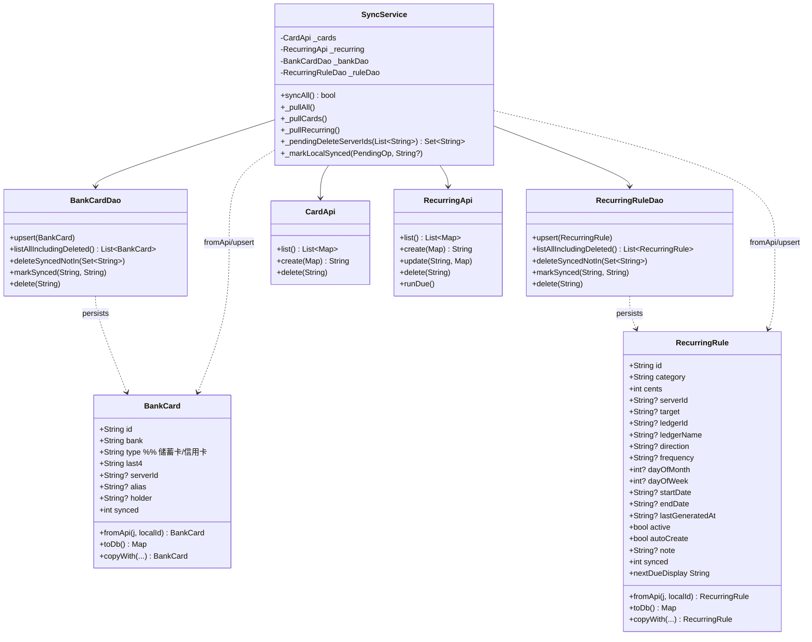
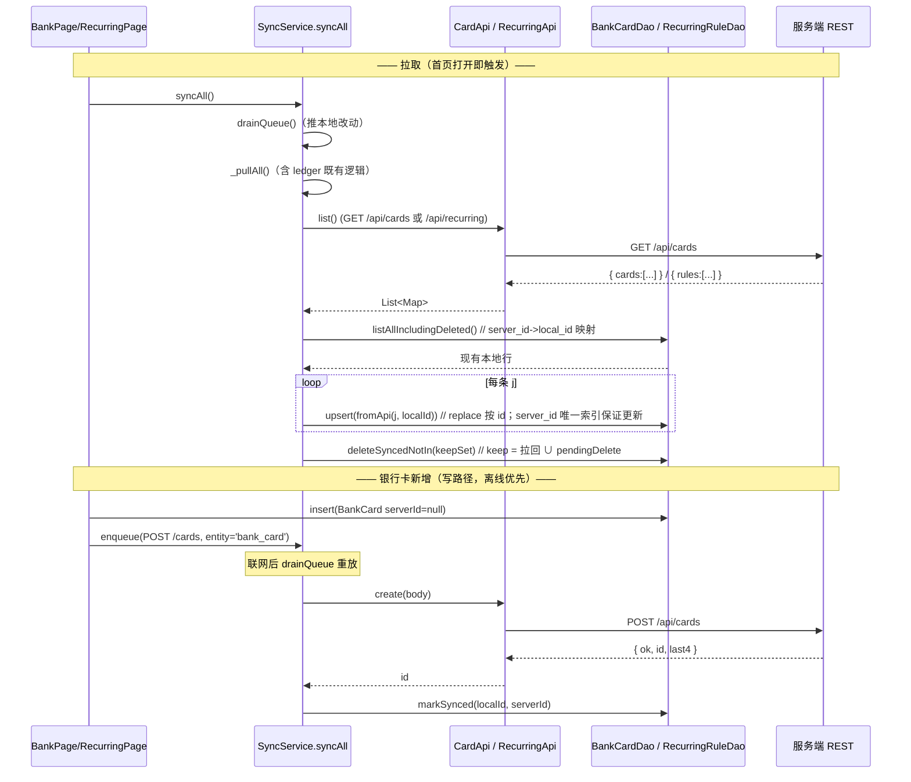

# 增量设计：银行卡备份 & 周期记账「也同步」+ UI 1:1 对齐（Bob / 高见远）

> 仓库：`MyAccountBook`（`mobile/` = Flutter，Dart + Provider + sqflite）
> 基线：`190aee0`（v2.0.30）。**增量扩展，不重写；不动服务端、不动 `flutter.yml`/签名。**
> 目标：① 让 `BankCard` / `RecurringRule` 在登录后从服务端 REST API 拉取并双向同步；② `bank_page` / `recurring_page` 1:1 复刻设计稿 `2:133` / `2:134`。
> 硬约束：离线优先；`server_id` 复用模式与 v2.0.30 一致；金额用分；DB 迁移走 `onUpgrade + ALTER TABLE`，版本 `3 → 4`；UI 一律用 `design_tokens`，不硬编码颜色。

---

## 0. 范围决策（先读这节）

| # | 议题 | 决策 | 理由 |
|---|---|---|---|
| D1 | **RecurringRule 新增规则是否本期推送（POST）** | **本期不做 POST**。范围 = 拉取(PULL) + 删除推送(DELETE) + 启用/停用/仅提醒切换推送(PATCH `active`/`autoCreate`)。`AddRuleSheet` 保持「本地新建」（无 `server_id` 的本地行在拉取对账中保留、不被删）。 | POST 需 `target`/`ledgerId`/`direction`/`frequency`/`day`/`startDate` 一整套表单（≈网页完整添加页）；工作量大、且本环境无法 `flutter analyze`，风险高。网页已建规则在移动端可见可管即兑现「也要同步」。新增并推送服务端列为后续 sprint。 |
| D2 | **银行卡解锁密码 Flutter 是否需要** | **不需要**。Flutter 只消费 `GET /api/cards` 未解锁路径返回的明文/尾号字段（`bankName`/`alias`/`cardType`/`holder`/`last4`），不调用 `POST /api/cards/unlock`，不显示完整卡号。 | 延续「仅存后四位、完整卡号不落库」约定；列表展示无需完整卡号。 |
| D3 | **CARD_SECRET 未配 → GET /api/cards 返 503** | **非致命跳过**。`_pullCards` catch `ApiException(status==503 或非 401/网络错误)`：记警告、`bank_cards` 不更新（本地数据保持）、**不中断**整体 `syncAll`。 | 银行卡同步失败不该拖垮账本/规则同步。 |
| D4 | **离线删除防「复活」** | 删除本地硬删 + 入队 `DELETE`（`server_id` 存入 `PendingOp.clientId`）；拉取前读取 pending `DELETE` 中该实体 `clientId` 集合，并入「保留集」避免服务端尚在的卡/规则被拉回本地。 | 离线优先核心不变量：本地删意图不能因下次拉取而丢失。 |
| D5 | **对账口径** | `deleteSyncedNotIn(keepSet)` 仅删 `server_id IS NOT NULL` 且不在 `keepSet` 的本地行；保留 `server_id IS NULL` 的本地新建（待推送）。与现有 ledger/entry 完全一致。 | — |
| D6 | **类型映射** | 储蓄卡↔`debit`，信用卡↔`credit`。pull：`debit`→`储蓄卡`、`credit`→`信用卡`；push(POST) 反向。卡图标：`debit`→🏦、`credit`→🏧（设计稿给 🏦/🏧/💳 三选，按类型区分最贴合「图标按卡类型选」）。 | — |

### 范围边界（本轮不做，避免 scope creep）

对齐 PRD `docs/architecture/ui-replication-prd.md`（§3 基准 / §5 A3/A4/A5）：

- **子页头部结构性改造（PRD A3 / P0-G4）**：现有 `PageHeader`（🏠👁⚙️ 右上、无左侧「返回」）本轮**不改**；改造范围 `[需拍板]`。bank/recurring 页继续复用现有 `PageHeader`。
- **容器 padding（PRD A4 / §3.2）**：非首页/非登录子页统一 `EdgeInsets.fromLTRB(24,56,24,24)`（= px-6 pt-14）。本设计已对 bank_page / recurring_page 应用，✅ 与基线一致。
- **设置外观 AppearanceSheet（PRD P0-09 / 节点 2:139）**：扩展主题模式/界面风格(隐藏液态玻璃)/字号/光效音效/试听 属**独立页面任务**，**不在本任务**（本任务仅 2:133 银行卡 + 2:134 周期记账）。
- **液态玻璃主题（PRD A5）**：本轮隐藏；目标页统一用 **classic 表面**（`AppCard(frosted:false)`），**不引入 `glass*` 令牌**。

---

## 1. 实现方案（Implementation Approach）

- **根因**：`SyncService._pullAll()` 只拉账本及其 entries，从不碰 `bank_cards` / `recurring_rules`；且这两个实体模型无 `server_id`、无对应 DAO 复用映射、UI 不消费服务端数据。
- **框架/库**：沿用既有 `sqflite` + `ApiClient`（Dio + 持久化 Cookie，手动 `Origin` 头绕过 CSRF）、`Provider`。**无新增依赖**。
- **架构模式**：保持现有「离线优先」——写路径先落本地库 + 入队 `PendingOp`；`syncAll()` 先 `drainQueue()` 推本地改动，再 `_pullAll()` 全量拉取并按 `server_id` 复用本地 `id`。新增两类实体的拉取复用 `server_id → local_id` 持久化映射（同 ledgers 模式），配合 `server_id` 唯一部分索引保证 upsert 真「更新」不「插入新行」。
- **关键风险点**：SQLite `ALTER TABLE ADD COLUMN` 不能加 `NOT NULL` 无默认列 → 新列全部可空（或 `DEFAULT 1`）；迁移需幂等（见 §2）。

---

## 2. DB Schema v4 变更（迁移）

`_version`：`3 → 4`。

### 2.1 新建库路径（`_createV2Tables` 同步更新，保证新装 = v4）

```sql
-- 银行卡：在 v2 原列(id,bank,type,last4,created_at)基础上补齐
CREATE TABLE IF NOT EXISTS bank_cards (
  id         TEXT PRIMARY KEY,
  bank       TEXT NOT NULL,
  type       TEXT NOT NULL,            -- 中文：储蓄卡 / 信用卡
  last4      TEXT NOT NULL,
  created_at INTEGER,
  server_id  TEXT,                     -- 服务端 cuid
  alias      TEXT,                     -- 卡片别名（服务端明文）
  holder     TEXT,                     -- 持卡人（服务端明文）
  synced     INTEGER NOT NULL DEFAULT 1
);
CREATE UNIQUE INDEX IF NOT EXISTS idx_bank_cards_server_id
  ON bank_cards(server_id) WHERE server_id IS NOT NULL;

-- 周期规则：在 v2 原列(id,category,cents,period,next_date,green_amount,created_at)基础上补齐
CREATE TABLE IF NOT EXISTS recurring_rules (
  id             TEXT PRIMARY KEY,
  category       TEXT NOT NULL,
  cents          INTEGER NOT NULL,
  period         TEXT NOT NULL,        -- 遗留展示串 每月/每周（本地新建用）
  next_date      TEXT NOT NULL,        -- 遗留展示串（本地新建用）
  green_amount   INTEGER NOT NULL DEFAULT 0,
  created_at     INTEGER,
  server_id      TEXT,
  target         TEXT,                 -- 'work' | 'general'
  ledger_id      TEXT,
  ledger_name    TEXT,                 -- 来自 ledger.name（服务端）
  direction      TEXT,                 -- 'income' | 'expense'
  frequency      TEXT,                 -- 'monthly' | 'weekly'
  day_of_month   INTEGER,
  day_of_week    INTEGER,
  start_date     TEXT,                 -- ISO
  end_date       TEXT,                 -- ISO | NULL
  last_generated_at TEXT,              -- ISO | NULL
  active         INTEGER NOT NULL DEFAULT 1,
  auto_create    INTEGER NOT NULL DEFAULT 1,
  note           TEXT,
  synced         INTEGER NOT NULL DEFAULT 1
);
CREATE UNIQUE INDEX IF NOT EXISTS idx_recurring_rules_server_id
  ON recurring_rules(server_id) WHERE server_id IS NOT NULL;
```

### 2.2 升级路径（`_onUpgrade`，`oldV < 4` 块）

- 对两张表用 `PRAGMA table_info(<t>)` 探测列是否存在，**仅对缺失列**做 `ALTER TABLE <t> ADD COLUMN ...`（SQLite 不支持 `ADD COLUMN IF NOT EXISTS`，探测保证幂等，避免重复升级 / 版本回退时崩）。
- 新列定义（可空；`active`/`auto_create`/`synced` 用 `DEFAULT 1`）：
  - `bank_cards`：`server_id TEXT`、`alias TEXT`、`holder TEXT`、`synced INTEGER NOT NULL DEFAULT 1`
  - `recurring_rules`：`server_id TEXT`、`target TEXT`、`ledger_id TEXT`、`ledger_name TEXT`、`direction TEXT`、`frequency TEXT`、`day_of_month INTEGER`、`day_of_week INTEGER`、`start_date TEXT`、`end_date TEXT`、`last_generated_at TEXT`、`active INTEGER NOT NULL DEFAULT 1`、`auto_create INTEGER NOT NULL DEFAULT 1`、`note TEXT`、`synced INTEGER NOT NULL DEFAULT 1`
- 建唯一部分索引（同 §2.1，`IF NOT EXISTS`）。
- **旧数据兼容**：既有本地卡/规则 `server_id = NULL` → 拉取对账中保留、不被删；首次 pull 后获得 `server_id` 并复用本地 `id`。无历史重复需清理（此前从未同步过这两类）。

---

## 3. 文件清单（相对路径）

| 文件 | 角色 | 动作 |
|---|---|---|
| `mobile/lib/data/models/bank_card.dart` | 银行卡模型 | **改**：加 `serverId`/`alias`/`holder`/`synced`；`fromApi`/`toDb`/`copyWith` |
| `mobile/lib/data/models/recurring_rule.dart` | 周期规则模型 | **改**：加 `serverId`/`target`/`ledgerId`/`ledgerName`/`direction`/`frequency`/`dayOfMonth`/`dayOfWeek`/`startDate`/`endDate`/`lastGeneratedAt`/`active`/`autoCreate`/`note`/`synced`；`fromApi`/`toDb`/`copyWith`；`nextDueDisplay` getter |
| `mobile/lib/data/db/database.dart` | 本地库 | **改**：`_version=4`；`_onUpgrade` 加 `oldV<4` 块；`_createV2Tables` 两表补齐新列+索引 |
| `mobile/lib/data/local/bank_card_dao.dart` | 银行卡 DAO | **改**：`upsert`/`listAllIncludingDeleted`/`deleteSyncedNotIn`/`markSynced` |
| `mobile/lib/data/local/recurring_rule_dao.dart` | 规则 DAO | **改**：同上 4 方法 |
| `mobile/lib/api/card_api.dart` | 银行卡 API 客户端 | **新** |
| `mobile/lib/api/recurring_api.dart` | 规则 API 客户端 | **新** |
| `mobile/lib/sync/sync_service.dart` | 同步引擎 | **改**：`_pullCards`/`_pullRecurring`；`_pullAll` 调用；`_markLocalSynced` 加 `bank_card`/`recurring_rule` 分支；`_pendingDeleteServerIds` 辅助 |
| `mobile/lib/ui/bank/bank_state.dart` | 银行卡状态 | **改**：`add` 扩 `alias`/`holder` + 入队 POST；`remove` 入队 DELETE |
| `mobile/lib/ui/bank/bank_page.dart` | 银行卡页 | **改**：`AddBankSheet` 加 alias/holder 输入；列表 tile 1:1（图标/类型右对齐/别名/尾号格式）；容器 `pt-14 px-6`；按钮 `＋ 添加银行卡` |
| `mobile/lib/ui/recurring/recurring_state.dart` | 规则状态 | **改**：`remove` 入队 DELETE；`toggle`(停用/仅提醒) 入队 PATCH |
| `mobile/lib/ui/recurring/recurring_page.dart` | 规则页 | **改**：说明底文案/圆角；规则卡内容（账本名/下次/停用·改为仅提醒）；生成按钮「立即生成到期的账」；添加按钮「＋ 添加周期规则」；容器 `pt-14 px-6` |
| `mobile/lib/ui/widgets/page_header.dart` | 共享头部 | **不改（超出本任务）**：A3 子页头部改造(左上 HomeButton+右上 FloatingToolbar+左返回)待用户拍板；本轮沿用现有 `PageHeader`（🏠👁⚙️ 右上、无左返回），bank/recurring 页继续复用 |

---

## 4. API 客户端接口（对齐契约）

```dart
// card_api.dart
class CardApi {
  final ApiClient _client;
  CardApi(this._client);
  // GET /api/cards -> { unlocked, cards:[...] }；取 cards 数组（未解锁路径已含明文/尾号）
  Future<List<Map<String, dynamic>>> list();
  // POST /api/cards -> { ok, id, last4 }
  Future<String> create(Map<String, dynamic> body); // body: bankName,alias?,cardType('debit'|'credit'),holder?,number
  Future<void> delete(String id);                   // DELETE /api/cards/[id]
}

// recurring_api.dart
class RecurringApi {
  final ApiClient _client;
  RecurringApi(this._client);
  // GET /api/recurring -> { rules:[...] }
  Future<List<Map<String, dynamic>>> list();
  // POST /api/recurring -> { ok, id }  （本期不使用，预留）
  Future<String> create(Map<String, dynamic> body);
  // PATCH /api/recurring/[id] -> { ok }（active?/autoCreate?/amountCents?/category?/note?/endDate?）
  Future<void> update(String id, Map<String, dynamic> body);
  Future<void> delete(String id);                   // DELETE /api/recurring/[id]
  // POST /api/recurring?run=1 -> 立即跑一次 materializeDueRules
  Future<void> runDue();
}
```

> 注：`GET /api/cards` 在 `CARD_SECRET` 未配时返 **503**（`ApiClient` 转 `ApiException`，`statusCode=503`）。`recurring` 不依赖 `CARD_SECRET`，不会 503。

---

## 5. 同步集成伪代码要点

### 5.1 拉取（`_pullAll` 内追加两步，非致命包裹）

```text
_pullAll():
  ... 既有 ledger/entry 拉取 ...
  try { await _pullCards(); }      on NetworkException rethrow；其余记日志跳过
  try { await _pullRecurring(); }  on NetworkException rethrow；其余记日志跳过

_pullCards():
  cards = CardApi.list()                     // 可能 503 -> ApiException（由上层 try 接住）
  pendingDel = _pendingDeleteServerIds('bank_card')
  localByServer = { sid->lid for row in BankCardDao.listAllIncludingDeleted() if row.serverId!=null }
  pulled = {}
  for j in cards:
    sid = j['id']
    lid = localByServer[sid] ?? _uuid.v4()
    BankCardDao.upsert(BankCard.fromApi(j, localId: lid))   // replace 按 id，server_id 唯一索引保证更新
    localByServer[sid] = lid; pulled.add(sid)
  keep = pulled ∪ pendingDel            // pendingDel 的本地已同步行暂时保留，防离线删复活
  BankCardDao.deleteSyncedNotIn(keep)   // 仅删 server_id NOT NULL 且不在 keep 的本地行

_pullRecurring():  // 同构，实体='recurring_rule'，用 RecurringRule.fromApi
```

### 5.2 推送写路径（写路径）

```text
// 银行卡新增（BankState.add）
card = BankCard(id, bank, type(中文), last4, alias, holder, serverId:null, synced:0)
BankCardDao().insert(card)
SyncService.instance.enqueue(
  method:'POST', path:'/cards',
  body:{ bankName:bank, alias:alias, cardType:_localToCardType(type), holder:holder, number:number },
  entity:'bank_card', entityLocalId:card.id)

// 银行卡删除（BankState.remove）
if card.serverId != null:
  SyncService.instance.enqueue(method:'DELETE', path:'/cards/${card.serverId}',
    entity:'bank_card', entityLocalId:card.id, clientId:card.serverId)   // clientId 存 serverId 供防复活
else:
  SyncService.instance.removePendingFor(card.id)   // 本地新建未推送，无服务端行
BankCardDao().delete(card.id)

// 周期规则删除（RecurringState.remove）—— 同构，entity='recurring_rule'，path /recurring/${sid}
// 周期规则切换（RecurringState.toggle：停用 / 改为仅提醒）
updated = rule.copyWith(active:?, autoCreate:?)   // 停用: active=false；仅提醒: autoCreate=false
RecurringRuleDao().upsert(updated)
if rule.serverId != null:
  SyncService.instance.enqueue(method:'PATCH', path:'/recurring/${rule.serverId}',
    body:{ active?:.., autoCreate?:.. }, entity:'recurring_rule', entityLocalId:rule.id)

// drainQueue 成功重放 POST/DELETE/PATCH 后调用 _markLocalSynced 需加分支：
case 'bank_card':      BankCardDao().markSynced(localId, sid)
case 'recurring_rule': RecurringRuleDao().markSynced(localId, sid)
```

### 5.3 辅助：`_pendingDeleteServerIds`

读 `pending_ops` 中 `status='pending' && method='DELETE' && entity ∈ {目标}` 的行，收集其 `client_id`（= `server_id`）为 `Set<String>`，供拉取「保留集」使用。

### 5.4 `BankCard.fromApi` / `RecurringRule.fromApi` 关键映射

- `BankCard.fromApi(j, localId)`：`id=localId`、`serverId=j['id']`、`bank=j['bankName']`、`type=_cardTypeToLocal(j['cardType'])`、`last4=j['last4']`、`alias=j['alias']`、`holder=j['holder']`、`synced=1`。
- `RecurringRule.fromApi(j, localId)`：`id=localId`、`serverId=j['id']`、`target/ledgerId/ledgerName(=j['ledger']['name'])/direction/category/cents(=j['amountCents'])/frequency/dayOfMonth/dayOfWeek/startDate/endDate/lastGeneratedAt/active(??true)/autoCreate(??true)/note`、`greenAmount = direction=='income'`、`period = frequency=='monthly'?'每月':'每周'`、`nextDate = ''`（展示用 `nextDueDisplay` 推算）。
- **`nextDueDisplay` getter**（服务端不返 nextDate，需客户端推算）：`serverId==null` → 返回 `nextDate`（本地新建遗留串）；否则按 `frequency`/`dayOfMonth`/`dayOfWeek`/`startDate`/`lastGeneratedAt` 推算「下一次到期日」（`yyyy-MM-dd`）：月→取 `dayOfMonth` 所在日（超月末取月末）；周→下一个 `dayOfWeek`（0=周日…6=周六）；若 `lastGeneratedAt` 已 ≥ 推算日则 +1 周期；`startDate` 未到则取 `startDate`。推算口径见待明确 §8-6。

---

## 6. UI 1:1 Gap 对照表

### 6.1 银行卡备份（设计稿 `2:133`）

| 元素 | 设计规格 | 当前 Flutter | 修复点 |
|---|---|---|---|
| 容器 padding | `px-6 pt-14` → `EdgeInsets.fromLTRB(24,56,24,24)` | `fromLTRB(16,48,16,24)` | 改为 `(24,56,24,24)` |
| 标题图标 | 💳 32 | `PageHeader` 图标 28（共享） | 保持共享 28（4px 偏差，全局一致）；严格 1:1 需全局改 32（见 §8-4） |
| 副标 | 「加密存储卡号 · 查看需验密码」(13, ink500) | 同文案(13, ink500) | ✅ 已一致 |
| 添加按钮 | 「＋ 添加银行卡」342×48 圆角16，ink900 填充白字16 | `AppPrimaryButton` label `添加银行卡`（无 ＋），高 52 | label→`＋ 添加银行卡`；高度 52 为共享值（48 偏差见 §8-4） |
| 卡片底 | 342×76 圆角16 白底描边 | `AppCard(frosted:false)` r16 白底描边 | ✅ 形状一致；高度随内容自适应（含别名/持卡人时会 >76，可接受） |
| 卡图标 | 🏦/🏧/💳 按类型 | 固定 💳 | `debit`→🏦、`credit`→🏧` |
| 银行名 | 18, ink900 | 15, ink900 | 18, ink900 |
| 类型 | 储蓄卡/信用卡，13, ink500，**右对齐** | 左对齐置于银行名下方，13, ink500 | 右对齐（Row `mainAxisAlignment.end` 或 `Align`），13, ink500 |
| 尾号 | 「**** 8888」14, ink500 | 「****${last4}」13 | 格式 `**** $last4`，14, ink500 |
| 别名/持卡人 | （服务端明文扩展字段） | 不显示 | 若 `alias` 非空显示 alias 行(13, ink500)；若 `holder` 非空显示 holder 行(13, ink500)，置于银行名下方 |

### 6.2 周期记账（设计稿 `2:134`）

| 元素 | 设计规格 | 当前 Flutter | 修复点 |
|---|---|---|---|
| 容器 padding | `px-6 pt-14` → `(24,56,24,24)` | `fromLTRB(16,48,16,24)` | 改为 `(24,56,24,24)` |
| 副标 | 无 | 「配一次，按周期自动记一笔」 | `PageHeader(subtitle:'')`（空副标，零高度占位） |
| 说明底 | 342×66 圆角16；「房租、订阅、工资这类固定项配一次就行。打开首页时自动补齐到期的账。」(11, ink500) | 文案「配一次，按周期自动记一笔。下次打开 App 时生成。」(13)、r12 | 文案改精确拷贝；fontSize 11；圆角 16；底色 `noteBg`+`noteBorder`（沿用） |
| 规则卡 | 342×110 圆角16 | `AppCard(frosted:false)` r16 | ✅ 形状；内容按下行重写 |
| 类别 | 16, Medium(500), ink900 | 15 | 16, `FontWeight.w500`, ink900 |
| 金额 | 15；支出 ink500 / 收入 语义绿 `#049E69` | `MoneyText(cents, green?green:ink500, 15)` | ✅ 逻辑对；确保 `greenAmount` 来自 `direction=='income'` |
| 删除 | 删除 12, 语义红，右对齐 | 删除 13, red | 12, `lightSemanticRed`/`darkSemanticRed`，右对齐 |
| 周期行 | 「每月 1 号 · 家庭账本」12, ink500 | 「周期 · ${period}」13, ink500 | `'$freqLabel $dayLabel · $ledgerName'`（freqLabel 每月/每周；dayLabel 月→`$dayOfMonth 号`、周→`周$dayOfWeek`；`ledgerName` 来自服务端），12, ink500 |
| 下次行 | 「下次：2026-09-01」11, ink400 | 「下次 · ${nextDate}」13, ink400 | `下次：${rule.nextDueDisplay}`，11, ink400 |
| 操作占位 | 「停用  改为仅提醒」11, ink500 | 「操作」占位 | **替换**「操作」为两可点：「停用」(PATCH `{active:false}`) 与「改为仅提醒」(PATCH `{autoCreate:false}`)，11, ink500；已停用可显「启用」 |
| 生成按钮 | 「立即生成到期的账」342×38 圆角12 浅底描边 | 「生成记录」`GestureDetector` v14 r12 | label→「立即生成到期的账」；显式高 38；圆角 12；`onTap`→`RecurringApi.runDue()` 后 `load()` 刷新（MVP：snackbar「已生成」+ reload） |
| 添加按钮 | 「＋ 添加周期规则」342×46 圆角16 虚线描边 | 「添加规则」虚线 r12 | label→「＋ 添加周期规则」；高 46；圆角 16；`lightBorderDashed` 描边 |

> UI 颜色全部走 `AppColors.lightInk*`/`darkInk*`/`lightSemanticGreen`/`lightSemanticRed` 与 `design_tokens`，不硬编码。

---

## 7. 有序任务列表（含依赖）

| Task ID | Task Name | Source Files | Dependencies | Priority |
|---|---|---|---|---|
| **T01** | 数据层：模型扩展 + DB v4 迁移 + DAO 新方法（`upsert`/`listAllIncludingDeleted`/`deleteSyncedNotIn`/`markSynced`） | `mobile/lib/data/models/bank_card.dart`、`mobile/lib/data/models/recurring_rule.dart`、`mobile/lib/data/db/database.dart`、`mobile/lib/data/local/bank_card_dao.dart`、`mobile/lib/data/local/recurring_rule_dao.dart` | 无 | P0 |
| **T02** | API 客户端（`card_api.dart`/`recurring_api.dart`）+ 同步引擎接入（`_pullCards`/`_pullRecurring`/`_pullAll` 调用 / `_markLocalSynced` 加分支 / `_pendingDeleteServerIds`） | `mobile/lib/api/card_api.dart`(新)、`mobile/lib/api/recurring_api.dart`(新)、`mobile/lib/sync/sync_service.dart` | T01 | P0 |
| **T03** | 银行卡：推送写路径（add 扩 alias/holder + 入队 POST；remove 入队 DELETE）+ `AddBankSheet` 扩字段 + 列表 UI 1:1 | `mobile/lib/ui/bank/bank_state.dart`、`mobile/lib/ui/bank/bank_page.dart` | T01, T02 | P0 |
| **T04** | 周期记账：删除/停用/仅提醒推送（PATCH）+ 生成按钮(runDue) + 列表 UI 1:1（说明底/规则卡/按钮文案） | `mobile/lib/ui/recurring/recurring_state.dart`、`mobile/lib/ui/recurring/recurring_page.dart` | T01, T02 | P0 |
| **T05** | 集成与验证：首页同步后这两页自动刷新、编译/烟雾检查、手动测试清单（离线增删、跨端一致） | `mobile/lib/ui/bank/bank_page.dart`、`mobile/lib/ui/recurring/recurring_page.dart`、`mobile/lib/sync/sync_service.dart`（必要时加轻量 `SyncNotifier`/事件） | T03, T04 | P1 |

> 每个任务均 ≥3 个文件；依赖链短（T03/T04 并行依赖 T01/T02），便于工程师并行推进。

---

## 8. 待明确事项（需主理人/用户拍板）

1. **RecurringRule 新增规则(POST) 本期确认不做？**（D1 建议不做，留后续 sprint）—— 是否认可？
2. **银行卡解锁密码**：Flutter 是否永远不需要（仅显示尾号）？确认（D2）。
3. **CARD_SECRET 未配 503**：按「非致命跳过、不中断整体同步」处理是否可接受（D3）？
4. **共享组件偏差已消解（对齐 PRD 基线）**：① `PageHeader` 结构性改造（🏠 右上/缺左返回）属 PRD A3 `[需拍板]`，**本轮不做**（见「范围边界」）；bank/recurring 页沿用现有 `PageHeader`。② 主按钮高度：`AppPrimaryButton` 高 **52** 符合 PRD §3.7「输入/主按钮 16（高 52）」统一基线（设计 2:133 写 48，以 PRD 基线 52 为准），非偏差。③ 仅剩次要项：标题图标 28 vs 设计 2:133 的 32（4px，全局一致，本页容忍）；如需严格 1:1 可随 A3 一并把 `PageHeader` 图标调到 32。④ 本轮回**隐藏液态玻璃**（PRD A5），目标页统一 classic 表面（`AppCard(frosted:false)`），不引入 `glass*` 令牌。
5. **卡图标映射**：`debit`→🏦 / `credit`→🏧 是否认可，还是统一用 💳？
6. **「下次日期」推算口径**：服务端不返 `nextDate`，移动端按 `frequency`/`day`/`startDate`/`lastGeneratedAt` 推算（月取 `dayOfMonth` 日、超月末取月末；周取下一个 `dayOfWeek`；`lastGeneratedAt ≥ 推算日`则 +1 周期）。口径是否认可？
7. **本地-only 规则标识**：新增的本地规则（无 `server_id`）列表是否加「仅本机」小灰标以区分已同步规则？建议加。
8. **同步后自动刷新**：当前 `load()` 在 page 创建时跑；若同步在页面已打开后完成，是否需要订阅「同步完成」事件刷新这两页？建议加轻量 `SyncNotifier`。本期是否必须（否则需用户返回首页再进）？

---

## 9. 类图 / 时序图

见同目录 `sync-cards-recurring-class.mermaid` 与 `sync-cards-recurring-sequence.mermaid`（另内联如下）。

### 9.1 类图



### 9.2 时序图（拉取 + 银行卡新增）



---

## 10. 共享约定（Shared Knowledge）

- 本地 `id` 永远本地 UUID；`server_id` 存服务端 cuid（同步前 `null`）。
- 金额一律分（cents，整数）；展示经 `Money.formatCents`。
- 离线优先：写先落本地 + 入队 `PendingOp`；`syncAll` 先推后拉。
- 对账仅删 `server_id IS NOT NULL` 且不在本次响应/保留集的本地行；保留未同步本地新建。
- 颜色全部走 `AppColors.*`（`lightInk*`/`darkInk*`/`lightSemanticGreen`/`lightSemanticRed`/`lightBorderDashed` 等），不硬编码。
- 容器统一 `px-6 pt-14`（= `EdgeInsets.fromLTRB(24,56,24,24)`），返回/标题在左（沿用 `PageHeader` 右上 🏠👁⚙️ 约定）。
- 服务端认证为纯 Cookie 会话（iron-session），`ApiClient` 自动带 `Origin` 绕过 CSRF 403；无 token 机制。
