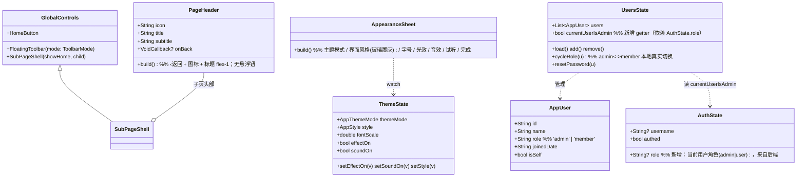
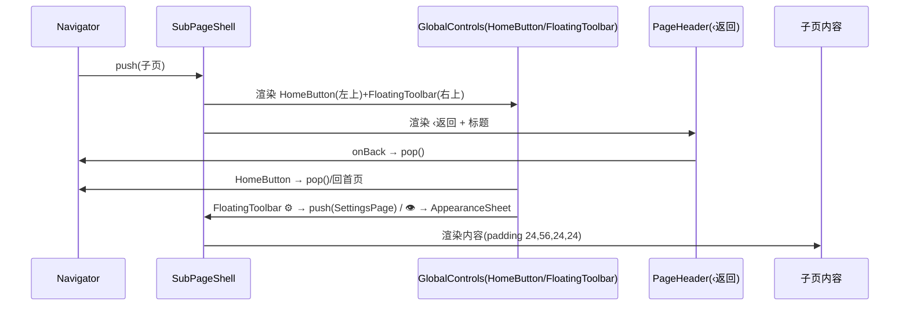
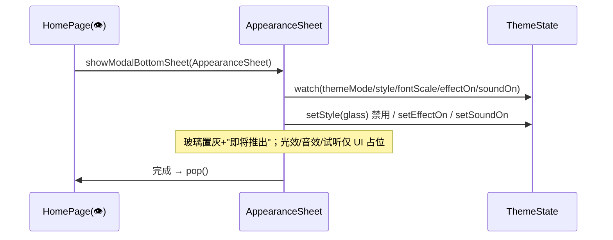

# 心愿便利贴 / MyAccountBook — UI 1:1 复刻增量架构设计 + 任务分解

> 文档类型：增量架构设计 + 任务分解（仅文档，不修改源码）
> 仓库：`MyAccountBook`（`mobile/lib/`，Dart + Provider + sqflite）
> 设计基准：Ardot `712589903280969`
> 作者：架构师（高见远）｜日期：本轮 sprint
> 上游：PRD `docs/architecture/ui-replication-prd.md`

---

## 0. 研究结论摘要（先读这一节）

### 0.1 决策落地映射
| 用户拍板 | 结论 | 落到哪个任务 |
|---|---|---|
| **D-A 子页头部统一** | 需新建全局覆盖层 `HomeButton`+`FloatingToolbar`（当前各页是内联 `AppFloatingButton`，并非"全局覆盖层"）；`PageHeader` 删除右侧 🏠/👁/⚙，改为左侧「‹ 返回」+ 标题 `flex-1`；11 个子页错误 padding `(16,48,16,24)`→`(24,56,24,24)` | **T0-1** |
| **D-B 用户管理 = UI + 管理员校验** | 后端**确有**真实权限原语（`requireAdmin`、`User.role: admin|user`、`/api/admin/users` 晋升/降权带防护）。但 Flutter `AuthState` **没有 role/isAdmin 字段**——客户端无法复刻"仅管理员可编辑"这一判定。复用本地原语 `AppUser.role`+`UsersState.cycleRole` 是真实的；"管理员门禁"需新增当前用户角色来源，**否则就是假权限** | **T-P1-04（用户管理）+ 风险 G1** |
| **D-C 设置外观 玻璃置灰** | `ThemeState` 已含 `style`/`effectOn`/`soundOn`，`AppStyle.glass` 已存在。扩展 `AppearanceSheet` 即可，无需后端 | **T0-3** |

### 0.2 design_tokens 核对结论（T0-2）
**`AppColors` 已 100% 覆盖 PRD §3.5 全部色板**，无需新增颜色令牌。唯一问题是 **`AppSwitch` 把关闭态轨道硬编码成了 `0xFFCBD5E1`**，应改为 `AppColors.lightBorderDashed`（同值，但走令牌）。详见 §6 风险 R-AppSwitch。

### 0.3 全局控件现状（重要）
- 当前**不存在**独立的 `HomeButton`/`FloatingToolbar` 类（Grep 无匹配）。每个页面都是**内联** `AppFloatingButton`：子页在 `PageHeader` 内或自己 `Row` 里放 🏠(右)/👁/⚙️；首页放 👁/✨；登录不放。
- 因此 D-A 的"全局覆盖层"是**新建**而非改造——需新增 `ui/widgets/global_controls.dart`。

### 0.4 缺失/歧义项（需主理人拍板，见 §6）
- **R-PwaPrompt**：`PwaInstallPrompt` 在 Flutter 工程中**不存在**（Grep 无匹配），它是 Web/PWA 概念，原生 App 无意义 → 建议本轮**按 N/A 处理，不实现假 PWA 提示**。
- **R-SettingsPage**：⚙️ 目前 push 的是 `settings_page.dart`（完整页），它**不在 13 个设计节点内**（13 节点里的"设置外观"是 👁 打开的 `AppearanceSheet` 2:139）。`settings_page.dart` 是否要随本轮复刻/重做，需确认。
- **R-RegTitle**：`register_page.dart` 标题用 `fontSize:28`，而 PRD 登录标题为 `30`、设计节点 `2:138` 待逐像素核对。

---

## 1. 共享前置任务（先于本批页面，独立成节）

### T0-1  PageHeader / 子页头部规范化改造（D-A）+ 全局控件核对 + 错误 padding 修正

**目标**：把"顶部全局控件"从各页内联抽离为唯一全局覆盖层；统一子页头部为「‹ 返回 + 标题 flex-1」；修正错误容器 padding。

**新增文件**
- `mobile/lib/ui/widgets/global_controls.dart`
  - `HomeButton`：基于 `AppFloatingButton`，点击 `Navigator.of(ctx).pop()`（或回首页），**仅子页显示，首页/登录不显示**。
  - `FloatingToolbar({required ToolbarMode mode})`：`mode=home` 渲染 👁/✨；`mode=subpage` 渲染 👁/⚙️。均 40×40 `cornerRadius:20`，令牌 `lightFloatingBtnBg/Border`/`darkFloatingBtnBg/Border`。
  - `SubPageShell({required Widget child, bool showHome = true})`：返回 `Scaffold`，`body` 用 `Stack`——`Positioned(top:12,left:12, child: showHome? HomeButton : SizedBox.shrink())` + `Positioned(top:12,right:12, child: FloatingToolbar(mode:subpage))` + 子页滚动内容。子页内容自带 `padding(24,56,24,24)`，顶部 56px 刚好清开 12+40 的悬浮钮。

**改造文件**
- `mobile/lib/ui/widgets/page_header.dart`（**签名变更，影响所有调用方**）
  - 删除右侧 🏠/👁/⚙️ 的 `Row`。
  - 新增顶部行：`‹ 返回`（`Icon(Icons.arrow_back_ios, size:18)` 或 `‹` Text 18 ink400）+ `icon`(emoji 28) + `Expanded(标题 22 w700 ink900 / 副标 13 ink500)`。`‹ 返回` 默认 `Navigator.of(ctx).pop()`，可传 `onBack` 覆盖。
  - 标题字号保持 22 w700（PRD 2:131..2:137 头部标题 18~22；实测 `PageHeader` 现用 22，维持），副标 13。

**错误 padding 修正清单（逐文件：`(16,48,16,24)` → `(24,56,24,24)`）**
| # | 文件 | 当前头部形式 | 改造动作 |
|---|---|---|---|
| 1 | `ui/general/general_ledger_page.dart` | 内联 `Row`（🏠右+⚙️） | 删内联悬浮钮 → 用 `PageHeader` + `SubPageShell` |
| 2 | `ui/work/work_ledger_page.dart` | `PageHeader` | 改用新 `PageHeader`(含‹返回) + `SubPageShell` |
| 3 | `ui/taoyuan/taoyuan_page.dart` | `PageHeader` | 同上 |
| 4 | `ui/travel/travel_page.dart` | `PageHeader` | 同上 |
| 5 | `ui/stats/stats_page.dart` | `PageHeader` | 同上 |
| 6 | `ui/search/search_page.dart` | `PageHeader` | 同上 |
| 7 | `ui/trash/trash_page.dart` | `PageHeader` | 同上 |
| 8 | `ui/ledgers/manage_ledgers_page.dart` | `PageHeader` | 同上 |
| 9 | `ui/users/users_page.dart` | `PageHeader` | 同上（D-B 同步见 T-P1-04） |
| 10 | `ui/work/work_summary_page.dart` | `PageHeader` | 同上 |
| 11 | `ui/settings_page.dart` | `PageHeader` | 同上（**R-SettingsPage**：不在 13 节点，仅一致性改造） |

> 说明：首页(`home_page.dart`) 用自有顶部（`(24,48,24,24)` + 👁/✨ 内联），登录(`login_page.dart`) 无控件——二者**不**走 `SubPageShell`，但首页建议改为 `FloatingToolbar(mode:home)` 以统一按钮实现。

**依赖**：无。　**优先级**：P0（影响全部 P0 子页的共享前置）。　**验收**：13 页浅/深节点全部头部满足"左上 HomeButton + 右上 FloatingToolbar + 左侧 ‹返回 + 标题 flex-1"，子页容器 `(24,56,24,24)`。

---

### T0-2  design_tokens 补缺（核对 + 清理）

**结论：无需新增任何颜色令牌。** `AppColors.light*/dark*` 已完整覆盖 PRD §3.5（含 `lightBrandPink`/`darkBrandPink`、`lightSemanticBlue`/`darkSemanticBlue`、`lightOverspend*`（bg/border/title/detail 共 4 个）、`lightFloatingBtnBg/Border`/`darkFloatingBtnBg/Border`、`lightBorderDashed` 等）。

**需处理的唯一问题（清理，非新增）**
- `mobile/lib/ui/widgets/app_switch.dart` 第 25 行 `inactiveTrackColor: const Color(0xFFCBD5E1)` 为**硬编码**。改为 `isDark ? AppColors.darkBorder : AppColors.lightBorderDashed`。
  - PRD §3.5：`lightBorderDashed` = `{0.796,0.835,0.882}` = `0xFFCBD5E1`（同值），故浅色视觉不变；深色改用 `darkBorder`(0xFF334155) 更贴合 1:1。
  - 如坚持"关闭态也走虚线描边语义"，可新增 `darkBorderDashed`（= `darkBorder` 镜像）到 `design_tokens.dart`——但 PRD 未列，属可选，**默认不新增**。

**依赖**：无。　**优先级**：P0（P0-G5 全量去硬编码的前提）。　**验收**：`AppColors` 覆盖 PRD 全色板；`AppSwitch` 无内联 `Color(0x...)`。

---

### T0-3  AppearanceSheet 扩展（D-C：玻璃置灰 + 光效/音效/试听占位 + 完成）

**目标**：把 `mobile/lib/ui/widgets/appearance_sheet.dart` 从 3 项扩展到对齐设计节点 `2:139`/`2:1099`。

**改造点（基于现有 `ThemeState` 字段，全部已就绪）**
| 区块 | 实现 | 令牌/状态 |
|---|---|---|
| 主题模式 | 白天/黑夜/系统 `SegmentedButton<AppThemeMode>` | `ts.themeMode` ✅ |
| 界面风格 | **默认**(classic) **正常可选**；**玻璃**(glass) **置灰禁用** + 文案「即将推出」 | `ts.style`；本环境不实现玻璃主题 |
| 字号 | 小/标准/大 `SegmentedButton<double>` | `ts.fontScale`(0.9/1.0/1.15) ✅ |
| 光效 | `AppSwitch` | `ts.effectOn` → `ts.setEffectOn` ✅（仅状态，无真实视觉逻辑，PRD P2-04） |
| 音效 | `AppSwitch` | `ts.soundOn` → `ts.setSoundOn` ✅（仅状态，无音频资源） |
| 试听 | `TextButton` 占位 | **无音频资源，点击仅 SnackBar「试听（演示）」**，不接真实播放 |
| 完成 | `AppPrimaryButton` | `Navigator.of(ctx).pop()` |

**规格**：面板顶圆角 `24`（现状 20→改 24）；分段钮 44h r12；开关 44×24 / 钮 20×10（`AppSwitch` 现有 `Switch` 默认尺寸接近，1:1 核对微调）；标题 `外观` 18 w700。

**依赖**：T0-2（去硬编码开关色，保证光效/音效开关 1:1）。　**优先级**：P0。　**验收**：`2:139`/`2:1099` 面板块齐全：玻璃置灰+「即将推出」、光效/音效/试听/完成齐全、顶圆角 24。

---

## 2. 逐页任务分解（T 列表）

> 字段：目标文件 / 依赖 / 优先级 / 验收(设计节点) / 关键改动点（对照 PRD §需求池）。
> 约定：凡子页均**依赖 T0-1**（头部/全局控件/padding）；首页/登录/注册走自有布局，不依赖 T0-1 头部改造（但登录/注册可复用 `AppSwitch` 清理后的效果）。

### P0 组

#### T-P0-01 首页
- **目标文件**：`ui/home_page.dart`
- **依赖**：T0-2（开关色清理，若首页用到）；建议改用 `FloatingToolbar(mode:home)` 统一 👁/✨。
- **优先级**：P0
- **验收**：`2:3`（浅）/ `2:569`（深）
- **关键改动点**（对照 PRD P0-01）：
  - 顶部时间/问候/退出保持；👁(AppearanceSheet) / ✨(SettingsPage) 改走 `FloatingToolbar(mode:home)`。
  - 超支卡 `342×70 r24` 红系，已用 `lightOverspend*`/`dark*` 镜像，逐像素核对 `2:3` 数值。
  - 总收入卡 `342×150 r16`，金额 28（正值品牌粉），分项 12 ink500。
  - 账本卡 `342×64 r16`：图标 22 / 标题 18 / 副标 12 / 箭头 18 ink400（现有 `LedgerFeatureCard` 核对箭头字号）。
  - 添加卡虚线边 + ＋24 ink500；页脚 12 ink400。
  - 浅/深双素材对照 `dark*` 令牌无遗漏。

#### T-P0-02 登录
- **目标文件**：`ui/login_page.dart`
- **依赖**：无（自有布局，无 HomeButton，符合 PRD P0-G2）
- **优先级**：P0
- **验收**：`2:76` / `2:642`
- **关键改动点**（PRD P0-02）：标题 30 ink900；用户名/密码输入 `342×52 r16` 占位 16 ink400；错误 14 红；登录按钮 `342×52 r16` 文字 16 白；注册链接 14 ink500。`_error` 颜色改 `isDark ? darkSemanticRed : lightSemanticRed`（现状硬编码 `lightSemanticRed`）。

#### T-P0-03 注册
- **目标文件**：`ui/register_page.dart`
- **依赖**：无
- **优先级**：P0
- **验收**：`2:138` / `2:1087`
- **关键改动点**（PRD P0-03）：复用 `AppTextField`/`AppPrimaryButton`；规格对齐登录。⚠️ **R-RegTitle**：现标题 28，需核对 `2:138` 是否应为 30；错误色同登录改镜像令牌。

#### T-P0-04 普通账本
- **目标文件**：`ui/general/general_ledger_page.dart` + `state/general_state.dart`（数据层已就绪，仅 UI）
- **依赖**：**T0-1**
- **优先级**：P0
- **验收**：`2:87` / `2:653`
- **关键改动点**（PRD P0-04）：删内联头部 → 新 `PageHeader`(📒,标题 20 w700,副标 13) + `SubPageShell`；padding 改 `(24,56,24,24)`；列表项金额收入绿(`lightSemanticGreen`)/支出红(`lightSemanticRed`)；汇总卡按设计。

#### T-P0-05 工作账本
- **目标文件**：`ui/work/work_ledger_page.dart`
- **依赖**：**T0-1**
- **优先级**：P0
- **验收**：`2:128` / `2:694`
- **关键改动点**（PRD P0-05）：与普通账本同构，复用新 `PageHeader`+`SubPageShell`，padding 修正。核对 💼 图标、标题/副标规格。

#### T-P0-06 桃源账本
- **目标文件**：`ui/taoyuan/taoyuan_page.dart`
- **依赖**：**T0-1**
- **优先级**：P0
- **验收**：`2:129` / `2:737`
- **关键改动点**（PRD P0-06）：同构，🌸 图标，padding 修正。

#### T-P0-07 旅游账本
- **目标文件**：`ui/travel/travel_page.dart`
- **依赖**：**T0-1**
- **优先级**：P0
- **验收**：`2:130` / `2:783`
- **关键改动点**（PRD P0-07）：同构，✈️ 图标，padding 修正；成员/分摊列表按设计。

#### T-P0-08 统计
- **目标文件**：`ui/stats/stats_page.dart` + `state/stats_state.dart`
- **依赖**：**T0-1**
- **优先级**：P0
- **验收**：`2:131` / `2:834`
- **关键改动点**（PRD P0-08）：新 `PageHeader`+`SubPageShell`，padding 修正；趋势/占比/环比同比卡片按 `2:131` 数值 1:1（含卡片尺寸、字号阶梯、颜色令牌）。

#### T-P0-09 设置外观
- **目标文件**：`ui/widgets/appearance_sheet.dart`（= T0-3 交付）
- **依赖**：T0-3 / T0-2
- **优先级**：P0
- **验收**：`2:139` / `2:1099`
- **关键改动点**：见 T0-3。

### P1 组

#### T-P1-01 搜索
- **目标文件**：`ui/search/search_page.dart` + `state/search_state.dart`
- **依赖**：**T0-1**
- **优先级**：P1
- **验收**：`2:132` / `2:875`
- **关键改动点**（PRD P1-01）：新 `PageHeader`(🔍)+`SubPageShell`，padding 修正；搜索框 + 结果列表卡按设计（复用 `AppCard`/`MoneyText`）。

#### T-P1-02 回收站
- **目标文件**：`ui/trash/trash_page.dart` + `state/trash_state.dart`
- **依赖**：**T0-1**
- **优先级**：P1
- **验收**：`2:135` / `2:977`
- **关键改动点**（PRD P1-02）：新 `PageHeader`(🗑️)+`SubPageShell`，padding 修正；删除项列表 + 60 天恢复提示按设计。

#### T-P1-03 添加删除账本
- **目标文件**：`ui/ledgers/manage_ledgers_page.dart`
- **依赖**：**T0-1**
- **优先级**：P1
- **验收**：`2:136` / `2:1009`
- **关键改动点**（PRD P1-03）：新 `PageHeader`(📚)+`SubPageShell`，padding 修正；账本列表 + 新增/恢复/管理入口按设计。

#### T-P1-04 用户管理（D-B 权限方案）
- **目标文件**：`ui/users/users_page.dart` + `state/users_state.dart` + `data/models/app_user.dart` + `state/auth_state.dart`（按需）
- **依赖**：**T0-1**
- **优先级**：P1
- **验收**：`2:137` / `2:1055`
- **关键改动点**（PRD P1-04 + D-B）：
  - **UI 1:1**：新 `PageHeader`(👥, "家庭成员 · 角色与权限")+`SubPageShell`，padding 修正；管理员徽章用 `lightSemanticBlue`/`darkSemanticBlue`（已实现）；用户列表/新建/重置密码/升级降级/删除按 `2:137`。
  - **权限实现方案（复用现有后端原语，不臆造契约）**：
    1. **本地真实原语（已存在，直接复用）**：`AppUser.role`(`admin|member`) + `UsersState.cycleRole`/`remove`/`add`（落 `family_member_dao`）。这是**真本地权限**，不是假的。
    2. **管理员门禁（关键缺口）**：后端 `requireAdmin()` 是真实判定原语；但 Flutter `AuthState` **无 role/isAdmin** → 客户端无法知道"当前用户是不是管理员"。**因此"仅管理员可编辑"无法在客户端真实落地**。
       - **可行落地（推荐，若范围内）**：给 `AuthState` 增加 `role` 字段（登录/注册响应或 `/api/user` 自取），`UsersState` 增加 `currentUserIsAdmin` getter；据此 **gate 编辑类操作**（新建/升级/降级/删除按钮仅管理员可见可点；非管理员仅只读列表）。这复用了后端 `User.role: admin|user` 语义（`member`≈`user`）。
       - **安全护栏（若做门禁，须镜像后端）**：禁止自我降级、保底 ≥1 管理员（对齐 `src/app/api/admin/users/[id]` 的 `badRequest('不能把自己降级'/'至少要保留一个管理员')`）；禁止删除自己（`不能删除自己`）。
       - **若 AuthState.role 不在本轮范围**：**明确按 R-D-B-G1 风险处理——保留本地 `cycleRole` 切换（真实本地权限），但不在客户端宣称"仅管理员可编辑"，即不实现假门禁**；编辑入口照常显示（与现状一致），待后端 role 同步落地后补门禁。
    3. **命名/语义对齐**（避免假契约）：Flutter `AppUser.role` 用 `member` 对应后端 `user`；`admin` 两端一致。本地 family_members 是"家庭级"概念，与后端"全局 admin/user"及"账本级 owner/editor/viewer(`ledgerRole.ts`)"是**不同轴**——用户管理页只映射全局 `admin|user` 轴，不混用账本角色。
  - **后端原语核对结论**：`src/lib/ownership.ts`(`requireAdmin`/`requireOwnedLedger`)、`src/app/api/admin/users/*`(role 枚举 `admin|user`、晋升/降权/删除带护栏) 均存在且可用作契约蓝本。**无需新增后端接口**；仅客户端缺"当前用户角色"这一输入。

---

## 3. 构建顺序

```
P0 前置（共享，必须最先）
  ├─ T0-2  design_tokens 清理（AppSwitch 去硬编码）        ── 无依赖，可并行起步
  ├─ T0-1  全局控件 + PageHeader 改造 + 11 页 padding 修正  ── 依赖 T0-2(开关色)
  └─ T0-3  AppearanceSheet 扩展(D-C)                       ── 依赖 T0-2

P0 页面分组（均依赖 T0-1）
  ├─ Group A 首页/登录/注册：T-P0-01, T-P0-02, T-P0-03  （自有布局，不依赖 T0-1 头部，可最早并行）
  ├─ Group B 四类账本：   T-P0-04, T-P0-05, T-P0-06, T-P0-07
  ├─ Group C 统计：       T-P0-08
  └─ Group D 设置外观：   T-P0-09 (= T0-3)

P1 页面（依赖 T0-1；用户管理额外依赖 D-B 决策 R-D-B-G1）
  ├─ T-P1-01 搜索
  ├─ T-P1-02 回收站
  ├─ T-P1-03 添加删除账本
  └─ T-P1-04 用户管理（D-B）
```

> 说明：Group A 不依赖 T0-1 头部改造（首页/登录/注册走自有顶部），可在 T0-2 完成后即并行；Group B/C/D 与 P1 全部依赖 T0-1，须 T0-1 合入后再启动。

---

## 4. 共享知识（工程师统一基准）

### 4.1 设计令牌 → AppColors 映射表（PRD §3.5）
| 语义 | 浅色令牌 | 深色令牌 | 备注 |
|---|---|---|---|
| 页面背景 | `lightPageBg` | `darkPageBg` | |
| 卡片表面 | `lightSurface` | `darkSurface` | |
| 卡片描边 | `lightBorder` | `darkBorder` | |
| 虚线描边(关态开关/添加卡) | `lightBorderDashed` | —(建议 `darkBorder`) | |
| 主文本 | `lightInk900` | `darkInk100` | |
| 次文本 | `lightInk500` | `darkInk500` | |
| 三级文本(箭头/页脚) | `lightInk400` | `darkInk400` | |
| 删红/错误 | `lightSemanticRed` | `darkSemanticRed` | 同值 |
| 收入绿 | `lightSemanticGreen` | `darkSemanticGreen` | 同值 |
| 管理员蓝 | `lightSemanticBlue` | `darkSemanticBlue` | 同值 |
| 品牌粉(收入高亮) | `lightBrandPink` | `darkBrandPink` | 同值 |
| 超支系(bg/border/title/detail) | `lightOverspend*`(4) | 镜像用 `darkSurface/darkBorder/darkInk100/darkInk400` | 仅首页超支卡 |
| 浮动钮底/描边 | `lightFloatingBtnBg/Border` | `darkFloatingBtnBg/Border` | 顶栏控件 |
| CTA 填充/文字 | `lightInk900` | `darkCtaFill`/`darkCtaText` | 主按钮 |

> **铁律**：禁止内联 `Color(0x...)`；任何新颜色先加 `AppColors` 令牌（本轮已确认无需新增）。

### 4.2 组件用法规则
- `PageHeader(icon, title, subtitle, onBack?)`：子页**唯一**头部；内含「‹ 返回 + 图标 + 标题(flex-1)」。**不得**在内部放 🏠/👁/⚙️（那些由 `SubPageShell` 全局覆盖层提供）。
- `SubPageShell(showHome:true, child)`：包裹子页 `Scaffold`，注入 `HomeButton`(左上) + `FloatingToolbar(mode:subpage)`(右上)。
- `AppCard(frosted:)` / `AppPrimaryButton` / `AppTextField` / `SectionLabel` / `MoneyText` / `AppSwitch` / `LedgerFeatureCard`：沿用，不重写。
- `AppFloatingButton(icon, onPressed?)`：40×40 r20，令牌化底/描边，**仅**在 `HomeButton`/`FloatingToolbar` 内部使用。

### 4.3 容器 / 返回按钮约定
- 首页、登录、注册：**自有顶部布局**，不用 `SubPageShell`。
- 其余 11 子页：`SubPageShell` + 内容 `padding: EdgeInsets.fromLTRB(24,56,24,24)`；画布宽 390、gutter 24 → 内容宽 **342**。
- 「‹ 返回」放**头部左侧**（在 `PageHeader` 内），**勿**放右上（会撞 `FloatingToolbar`）。

### 4.4 字号阶梯（实测，来自 2:3/2:76/2:139）
`30` 登录标题 · `28` 大额金额/注册标题(待核) · `22` 账本卡图标/头部标题 · `18` 卡标题/面板标题/添加卡标题 · `16` 状态栏时间/输入占位/按钮文字 · `14` 问候/项副标/小按钮 · `13` 区块标签/收入标题/头部副标 · `12` 说明/超支标题/卡副标/页脚。
> 字号经 `ThemeState.fontScale`(0.9/1.0/1.15) × `MediaQuery.textScaler` 全局生效（PRD P2-03）。

### 4.5 圆角/尺寸基准
卡片 `16`；首页超支卡 `24`；输入/主按钮 `16`（高 52）；分段钮 `12`（高 44）；开关轨 `12`(44×24)/钮 `10`(20×20)；设置面板顶 `24`；悬浮钮 `20`(40×40)；`AppearanceSheet` 面板顶 `24`。

---

## 5. 数据模型与接口（面向本轮改动）



**调用流（子页打开 → 头部/全局控件）**


**调用流（AppearanceSheet 打开，D-C）**


---

## 6. 风险与开放项

### 6.1 共享风险
- **R-D-B-G1（最关键，需主理人/用户拍板）**：用户管理"管理员门禁"依赖 `AuthState.role`，而该字段**当前不存在**。选项：(a) 本轮给 `AuthState` 加 `role` 并 gate 编辑操作（真实权限，需确认登录/注册响应是否返回 role 或需新增 `/api/user` 自取）；(b) 不做门禁，保留本地 `cycleRole` 切换且不宣称"仅管理员可编辑"（不实现假权限）。**建议选 (a) 若后端能在登录返回 role；否则 (b)**。
- **R-D-B-G2（命名/语义）**：Flutter `member` vs 后端 `user`；家庭级 `admin|member` vs 全局 `admin|user` vs 账本级 `owner|editor|viewer`。用户管理页只映射全局 `admin|user` 轴；勿混用账本角色。
- **R-D-B-G3（护栏）**：若做门禁，须镜像后端"禁自我降级/保 ≥1 管理员/禁删自己"，否则会出现后端会拒但客户端先放行的坏体验。
- **R-D-B-G4（无假契约）**：严禁新建后端接口；仅复用 `ownership.ts` / `admin/users` 既有语义。
- **R-PwaPrompt**：`PwaInstallPrompt` 在 Flutter 工程中**不存在**（Web/PWA 概念），原生 App 无意义。建议本轮**按 N/A 处理，不实现假 PWA 提示**；若坚持要有，需主理人确认以何种原生组件替代（不在 13 节点内）。
- **R-SettingsPage**：⚙️ 现 push `settings_page.dart`（完整页），**不在 13 设计节点**；13 节点里的"设置外观"是 👁 的 `AppearanceSheet`(2:139)。`settings_page.dart` 本轮仅做 T0-1 一致性改造（头部/padding），是否随本轮重做需确认。
- **R-AppSwitch**：`app_switch.dart` 硬编码 `0xFFCBD5E1`，须在 T0-2 改为 `AppColors.lightBorderDashed`（深色 `darkBorder`）。属 P0-G5 去硬编码前提。

### 6.2 逐页风险（每页 1–2 条）
| 页 | 风险/开放项 |
|---|---|
| 首页 | 顶部时间 `y:22` 为设计稿状态栏示意，Flutter 用 `SafeArea`+系统状态栏，需核对视觉对齐而非照搬绝对 y；👁/✨ 建议改 `FloatingToolbar(mode:home)`。 |
| 登录 | 无 `HomeButton`（符合 PRD）；`_error` 用 `lightSemanticRed` 硬编码，改镜像令牌。 |
| 注册 | **R-RegTitle**：标题字号 28 vs 设计 `2:138` 待逐像素核（可能应为 30）；错误色同登录改镜像。 |
| 普通账本 | 内联头部改 `PageHeader`+`SubPageShell`；副标"本月 · 3 人共享"为占位文案，按 `2:87` 核对。 |
| 工作账本 | 同普通账本同构；📊/💼 图标与标题/副标按 `2:128`。 |
| 桃源账本 | 🌸 图标；列表数据层已就绪，仅 UI 对齐。 |
| 旅游账本 | ✈️ 图标；成员/分摊卡按 `2:130`。 |
| 统计 | 趋势/占比/环比同比三类卡数值密集，须逐像素核 `2:131`（含坐标轴/图例未在前序实现，需补）。 |
| 设置外观 | 玻璃置灰 + 光效/音效/试听占位；**无音视频资源**，试听仅 SnackBar 占位（PRD P2-04）。 |
| 搜索 | 结果列表空态/有态按 `2:132`；复用 `SearchState`。 |
| 回收站 | 60 天恢复倒计时文案按 `2:135`；`TrashState` 已就绪。 |
| 添加删除账本 | 新增/恢复/管理三入口按 `2:136`；`LedgerListState` 已就绪。 |
| 用户管理 | 见 R-D-B-G1~G4；管理员蓝徽章已实现，重点在权限门禁决策。 |

### 6.3 新增路由/状态评估
- **无需新增路由**：Glob 确认 13 页均有对应 `.dart`，入口由 `home_page.dart` 的 `Navigator.push` 与 `routes.dart` 的 `pageForLedger` 覆盖（PRD A7 已确认）。
- **状态层**：所有页数据层已存在（`GeneralState`/`WorkState`/`TaoyuanState`/`TravelState`/`StatsState`/`SearchState`/`TrashState`/`UsersState`/`LedgerListState`/`AuthState`）。**无页面缺失 Flutter 数据层**。
- **唯一可能新增的状态字段**：`AuthState.role`（仅当 R-D-B-G1 选 (a)）。

---

_附录：研究依据文件——`mobile/lib/theme/design_tokens.dart`、`mobile/lib/state/theme_state.dart`、`mobile/lib/state/auth_state.dart`、`mobile/lib/ui/widgets/{page_header,app_floating_button,app_switch,appearance_sheet}.dart`、11 个待改子页、`mobile/lib/data/models/app_user.dart`、`mobile/lib/state/users_state.dart`；后端原语 `src/lib/ownership.ts`、`src/app/api/admin/users/{route,[id]/route}.ts`、`src/lib/ledgerRole.ts`。_
