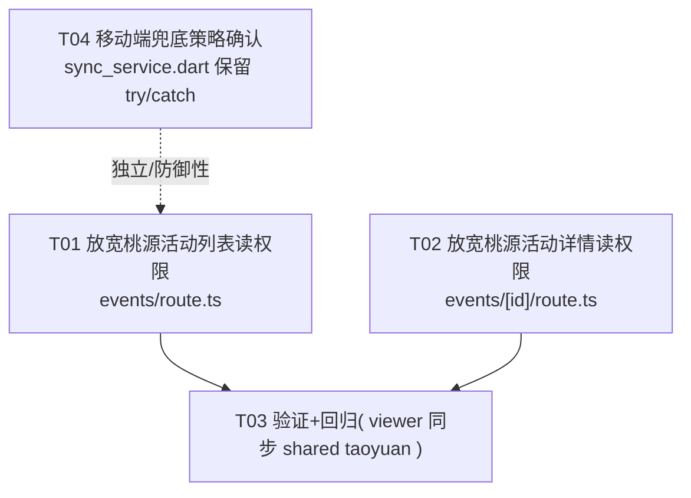

# 多账本移动端同步 — 读权限放宽设计（Bob / 高见远）

> 适用范围：Next.js 15 + Prisma + SQLite 服务端，配合 Flutter 移动端（`mobile/lib/sync/sync_service.dart`）。
> 本次目标：**让登录用户在 Flutter 中能完整同步其参与的全部账本（own + 通过 LedgerMember 共享的，含 viewer/editor/owner）**。
> 设计原则（硬约束）：
> 1. **只放松“读”，写/变更接口维持原门槛**（editor / owner），绝不被本次改动误伤。
> 2. 放宽**仅基于「是否参与该账本（LedgerMember）」**，权限不足一律返 **404**（防成员枚举），**绝不引入任何全局 admin 越权读**。
> 3. 改动面尽量小、可审计。

---

## Part A：现状调研与设计

### 1. Implementation Approach（根因与方案）

**根因（已代码确认）**：移动端 `_pullAll` 遍历 `GET /ledgers` 返回的账本，再逐账本调各类型读接口。
其中 **桃源（taoyuan）账本的两个 GET 读接口** 把门槛硬编码成了 `editor`：

- `GET /events?ledgerId=<id>` → `src/app/api/events/route.ts` 的 `resolveTaoyuanLedger(...)` 内部硬编码 `roleAtLeast(rawRole, 'editor')`。
- `GET /events/<id>` → `src/app/api/events/[id]/route.ts` 的 `requireOwnedEvent(id)` 默认 `minRole: 'editor'`。

当移动端用户只是共享桃源账本的 **viewer** 时，这两个接口返回 **404**，逐账本失败（移动端现有 try/catch 已兜底跳过，但属于治标）。
**其余 5 个读接口当前已是 `viewer`**（`/ledgers` 列表、`/ledgers/{id}/entries`、`/entries?ledgerId`、`/ledgers/{id}/members`、`/ledgers/{id}/expenses`），无需改动。

**方案**：仅把上述两个桃源读接口的门槛从 `editor` 放宽到 `viewer`（任何 LedgerMember 参与者可读），写接口与 owner 级接口一律不动。
`ownership.ts` / `ledgerRole.ts` 已具备完整的 `minRole` 机制，**无需改这两个 lib 文件**，改动只落在两个 route handler。

**技术选型说明**：沿用既有 `requireOwnedLedger` / `requireOwnedEvent` 的 `minRole` 参数与 `roleAtLeast` 比较；`resolveTaoyuanLedger` 增加可选 `minRole` 形参（默认 `'editor'`，保证 POST 写路径行为不变）。

---

### 2. File List（相对路径）

| 文件 | 角色 | 本次动作 |
|---|---|---|
| `src/app/api/events/route.ts` | 桃源活动列表 GET + `resolveTaoyuanLedger` | **改**：列表读放宽到 viewer |
| `src/app/api/events/[id]/route.ts` | 桃源活动详情 GET | **改**：详情读放宽到 viewer |
| `src/app/api/ledgers/route.ts` | 账本列表 GET（移动端“账本列表接口”） | 核对，**不改**（已返回全部成员账本） |
| `src/lib/ownership.ts` | `requireOwnedLedger` / `requireOwnedEvent` / `requireAdmin` 等 | 核对，**不改**（机制已具备） |
| `src/lib/ledgerRole.ts` | `LedgerRole` 枚举与 `roleAtLeast` | 核对，**不改** |
| `mobile/lib/sync/sync_service.dart` | 移动端同步引擎 `_pullAll` | 核对，**实现不改**，仅保留兜底 try/catch（见第 6 节建议） |
| `src/lib/ledgerRole.test.ts` + 新增 route 测试（可选） | 测试 | 补 viewer 读权限回归用例 |

---

### 3. Data Structures and Interfaces

```mermaid
classDiagram
    class LedgerRole {
        <<enumeration>>
        viewer
        editor
        owner
    }

    class LedgerOptions {
        +kind: LedgerKind
        +kindMessage: string
        +minRole: LedgerRole
    }

    class OwnershipGuards {
        +requireOwnedLedger(id, opts) LedgerOptions
        +requireOwnedEvent(id, opts) LedgerOptions
        +requireOwnedEntry(id, opts)
        +requireOwnedGeneralEntry(ledgerId, entryId, opts)
        +requireOwnedTripExpense(ledgerId, expenseId, opts)
        +requireOwnedEventAmount(eventId, amountId, opts)
        +requireSessionUser()
        +requireAdmin()   %% 仅用于 /api/admin/users 账户管理，绝不碰账本数据
    }
    OwnershipGuards ..> LedgerOptions : opts.minRole

    class ReadGuardDefaults {
        requireOwnedLedger: 默认 owner
        requireOwnedEvent: 默认 editor  ← 本次改 viewer(仅 GET)
    }

    note for OwnershipGuards "读接口显式传 minRole:'viewer'；\n写接口维持 editor/owner（默认或不传）"

    class ChangedEndpoints {
        GET /events?ledgerId  editor→viewer
        GET /events/{id}      editor→viewer
    }
    ChangedEndpoints ..> OwnershipGuards : 调用
```

---

### 4. Program Call Flow

```mermaid
sequenceDiagram
    participant App as Flutter SyncService._pullAll
    participant List as GET /ledgers
    participant Srv as 各账本读路由（服务端）

    App->>List: GET /ledgers (limit=200, cursor)
    List-->>App: 全部成员账本 (owner/editor/viewer 都返回)

    loop 每个账本 j
        alt kind = general
            App->>Srv: GET /ledgers/{id}/entries
            Srv-->>App: entries (minRole viewer ✓)
        else kind = work
            App->>Srv: GET /entries?ledgerId={id}
            Srv-->>App: entries (minRole viewer ✓)
        else kind = taoyuan
            App->>Srv: GET /events?ledgerId={id}
            Note over Srv: resolveTaoyuanLedger 硬编码 editor
            alt 当前用户为 viewer（共享只读）
                Srv-->>App: 404 ❌ (现已 try/catch 兜底跳过)
            else editor / owner
                Srv-->>App: events ✓
            end
            App->>Srv: GET /events/{id}
            Note over Srv: requireOwnedEvent 默认 editor
            alt viewer
                Srv-->>App: 404 ❌
            else editor/owner
                Srv-->>App: event + amounts ✓
            end
        else kind = travel
            App->>Srv: GET /ledgers/{id}/members
            Srv-->>App: members (viewer ✓)
            App->>Srv: GET /ledgers/{id}/expenses?all=1
            Srv-->>App: expenses (viewer ✓)
        end
    end

    Note over App,Srv: 修复后：桃源两读接口 minRole='viewer'，
    viewer 参与者不再 404，逐账本同步全部成功
```

---

### 5. Anything UNCLEAR / 已确认的不变量

- **viewer 能否读软删除数据？** 不能，且保持一致。活动列表 `prisma.event.findMany({ where: { ledgerId, deletedAt: null } })`；详情 `requireOwnedEvent` 内部 `if (event.deletedAt !== null) return notFound()`；其余类型走 `NOT_DELETED`。viewer 与 owner/editor 一样看不到回收站内容。✅ 无需改动。
- **是否还有遗漏的「按账本读」接口？** 已审计移动端同步实际调用的 7 个 GET 端点（见下表）+ 额外的 `GET /events/paid`（web 用，已 `viewer`）。无遗漏。
- **分页/统计接口是否也要放宽？** `/events?ledgerId=` 本身就是分页列表（cursor 分页），本次一并覆盖；无独立的“统计 GET”在同步路径中。✅
- **是否引入 admin 全局读？** 否。`requireAdmin()` 仅在 `src/app/api/admin/users/route.ts` 与 `src/app/api/admin/users/[id]/route.ts` 使用，内容仅为用户账号的增/改密码/删（操作 `prisma.user`），**完全不查询 Ledger / LedgerMember / 任何账本数据**。本次改动不触碰 admin 路径。✅

---

## Part B：任务分解

### 6. Required Packages

无新增依赖。`zod` / `prisma` / `@/lib/*` 均为既有。

### 7. 逐账本读接口清单（问题 2 的答案）

| 移动端调用 | 服务端路由 (GET) | handler 文件 | 守卫 | 当前 minRole | 需放宽到 viewer？ |
|---|---|---|---|---|---|
| `_ledgers.list()` | `GET /ledgers` | `src/app/api/ledgers/route.ts` | `requireSessionUser` + 直接查 `members.some` | —（返回**全部成员**账本） | 否（已正确）|
| `_general.list(sid)` | `GET /ledgers/{id}/entries` | `src/app/api/ledgers/[id]/entries/route.ts` | `requireOwnedLedger(id,{kind:'general',…})` | **viewer** | 否 |
| `_work.list(sid)` | `GET /entries?ledgerId={id}` | `src/app/api/entries/route.ts` | `requireSessionUser` + `resolveWorkLedger(…,'viewer')` | **viewer** | 否 |
| `_events.list(sid)` | `GET /events?ledgerId={id}` | `src/app/api/events/route.ts` | `requireSessionUser` + `resolveTaoyuanLedger(…)` | **editor（硬编码）** | ✅ **是** |
| `_events.getById(sid)` | `GET /events/{id}` | `src/app/api/events/[id]/route.ts` | `requireOwnedEvent(id)` | **editor（默认）** | ✅ **是** |
| `_trip.listMembers(sid)` | `GET /ledgers/{id}/members` | `src/app/api/ledgers/[id]/members/route.ts` | `requireOwnedLedger(id,{kind:'travel',…})` | **viewer** | 否 |
| `_trip.listExpenses(sid, all)` | `GET /ledgers/{id}/expenses?all=1` | `src/app/api/ledgers/[id]/expenses/route.ts` | `requireOwnedLedger(id,{kind:'travel',…})` | **viewer** | 否 |

参考（web 侧，不在移动端同步路径，已正确）：`GET /events/paid?ledgerId=` → `resolveTaoyuanRead(…,'viewer')` ✅。

### 写接口必须保持不变（问题 3 的答案）

| 接口 | 文件 | 门槛（维持） |
|---|---|---|
| `POST /ledgers/{id}/entries` | `src/app/api/ledgers/[id]/entries/route.ts` | editor |
| `POST /ledgers/{id}/expenses` | `src/app/api/ledgers/[id]/expenses/route.ts` | editor |
| `POST /ledgers/{id}/members` | `src/app/api/ledgers/[id]/members/route.ts` | editor |
| `PATCH`/`DELETE /ledgers/{id}/members/{mid}` | `src/app/api/ledgers/[id]/members/[memberId]/route.ts` | editor |
| `POST /entries` | `src/app/api/entries/route.ts` | editor |
| `POST /events` | `src/app/api/events/route.ts` | editor（默认，不变） |
| `POST`/`PATCH`/`DELETE /events/{id}` 及 amounts | `src/app/api/events/[id]*/route.ts` | editor（默认，不变） |
| `PATCH`/`DELETE /ledgers/{id}`（设置/软删/恢复） | `src/app/api/ledgers/[id]/route.ts` | owner |
| 协作/邀请管理 `collaborators`、`invites` | `src/app/api/ledgers/[id]/collaborators`、`/invites` | owner |

> 本次两处改动**只动 GET**；上述写/owner 接口一行都不碰。

### 具体改动点（工程师可直接照改）

**改动 1 — `src/app/api/events/route.ts`**

当前 `resolveTaoyuanLedger` 第 154 行硬编码 `editor`：
```ts
async function resolveTaoyuanLedger(
  userId: string,
  explicit: string | null,
): Promise<string | Response> {
  if (!explicit) return resolveOwnLedgerId(userId, 'taoyuan');
  const ledger = await prisma.ledger.findUnique({
    where: { id: explicit },
    select: { kind: true, members: { where: { userId }, select: { role: true }, take: 1 } },
  });
  if (!ledger || ledger.kind !== 'taoyuan') return notFound('账本不存在');
  const rawRole = ledger.members[0]?.role;
  if (!rawRole || !isLedgerRole(rawRole)) return notFound('账本不存在');
  if (!roleAtLeast(rawRole, 'editor')) return notFound('账本不存在'); // ← 写路径需要，但列表读不该用
  return explicit;
}
```
改为接收 `minRole` 形参（默认 `'editor'`，保证 POST 写路径零改动），GET 显式传 `'viewer'`：
```ts
async function resolveTaoyuanLedger(
  userId: string,
  explicit: string | null,
  minRole: 'viewer' | 'editor' = 'editor',
): Promise<string | Response> {
  if (!explicit) return resolveOwnLedgerId(userId, 'taoyuan');
  const ledger = await prisma.ledger.findUnique({
    where: { id: explicit },
    select: { kind: true, members: { where: { userId }, select: { role: true }, take: 1 } },
  });
  if (!ledger || ledger.kind !== 'taoyuan') return notFound('账本不存在');
  const rawRole = ledger.members[0]?.role;
  if (!rawRole || !isLedgerRole(rawRole)) return notFound('账本不存在');
  if (!roleAtLeast(rawRole, minRole)) return notFound('账本不存在');
  return explicit;
}
```
GET handler 第 34 行改为：
```ts
const ledgerId = await resolveTaoyuanLedger(
  user.id,
  url.searchParams.get('ledgerId'),
  'viewer',   // ← 读放宽
);
```
POST（第 85 行）保持 `resolveTaoyuanLedger(user.id, p.ledgerId ?? null)`（默认 editor，不变）。

**改动 2 — `src/app/api/events/[id]/route.ts`**

GET 第 14 行：
```ts
const ctx = await requireOwnedEvent(id);              // 当前默认 editor → viewer 才对读开放
```
改为：
```ts
const ctx = await requireOwnedEvent(id, { minRole: 'viewer' });
```
PATCH（第 80 行）、DELETE（第 110 行）保持 `requireOwnedEvent(id)`（默认 editor，不变）。

### 8. Shared Knowledge（跨切面约定）

- `minRole` 取值语义统一为 `'viewer' | 'editor' | 'owner'`，由 `src/lib/ledgerRole.ts` 的 `roleAtLeast` 比较（viewer<editor<owner）。
- **权限不足统一返 404**（不是 403），与“不存在/不属于你”同信号，防成员枚举。
- 软删除数据（`deletedAt != null`）对任何角色（含 viewer）都不可见；回收站/恢复走专门路径。
- 读接口放宽的**唯一依据**是「当前用户在该账本的 LedgerMember 行存在」；任何路径都不得因为“是 admin”而越权读他人账本。
- 移动端同步前导接口 `GET /ledgers` 返回的是「用户作为成员的全部未删除账本」，是同步正确性的前提，改动时不得误加 `role: 'owner'` 过滤。

### 9. Task Dependency Graph



---

## 任务列表（有序，含依赖）

| Task ID | Task Name | Source Files | Dependencies | Priority |
|---|---|---|---|---|
| **T01** | 放宽桃源活动**列表**读权限到 viewer | `src/app/api/events/route.ts`（改 `resolveTaoyuanLedger` 加 `minRole` 形参；GET 传 `'viewer'`） | 无 | P0 |
| **T02** | 放宽桃源活动**详情**读权限到 viewer | `src/app/api/events/[id]/route.ts`（GET 改 `requireOwnedEvent(id, { minRole: 'viewer' })`） | 无 | P0 |
| **T03** | 验证与回归：viewer 登录后能完整同步 shared taoyuan 账本；补充权限回归测试（仓库当前无 route 测试脚手架，建议新增） | 测试文件（建议新增 `src/app/api/events/route.test.ts`、`events/[id]/route.test.ts` 或集成用例） | T01, T02 | P1 |
| **T04** | 移动端兜底策略确认：保留 `sync_service.dart` 逐账本 try/catch 作防御，增强失败账本日志/非阻塞提示，**不删除** | `mobile/lib/sync/sync_service.dart`（仅注释/日志，不改控制流） | 无 | P2 |

---

## 问题 1 / 4 / 6 的结论汇总

1. **移动端“账本列表接口”定位**：`LedgerApi.list()` → `GET /ledgers`（`src/app/api/ledgers/route.ts`）。当前用 `requireSessionUser` + `prisma.ledger.findMany({ where: { members: { some: { userId } }, deletedAt: null } })`，**已返回用户参与的全部账本（含 LedgerMember 共享的 owner/editor/viewer）**。✅ 无需改动；仅需注意不要被误改成只返回 owner。

2. **逐账本读接口清单**：见上表。7 个接口中仅 **桃源的 2 个**（`GET /events?ledgerId=` 与 `GET /events/{id}`）需从 `editor` 放宽到 `viewer`；其余 5 个已是 `viewer`。

3. **写接口保持不变**：见上表，POST/PATCH/DELETE 与 owner 级接口一律维持 editor/owner，本次不触碰。

4. **admin 越权核查结论**：系统中**不存在**“管理员可读取全部用户账本”的全局读路径。`requireAdmin()` 仅用于 `src/app/api/admin/users/route.ts` 与 `src/app/api/admin/users/[id]/route.ts`（用户账号增/改密/删），不查询任何账本数据。本次改动不引入、也不扩大任何 admin 越权读。✅

5. **实现方案 + 任务分解**：见 Part B（T01–T04 + 具体改动点）。改动文件仅 2 个 route handler；无新增依赖；共享约定见第 8 节；风险见第 5 节（软删除不可见、分页已覆盖、无遗漏读接口）。

6. **移动端兜底代码建议**：**保留** `sync_service.dart` 的逐账本 try/catch 作为防御（治本后仍可能遇到服务端 5xx / 残留脏数据 / 网络中断，兜底能避免单账本拖垮整体）。建议：① 保留现有控制流；② 在 `errors.add('$sid($kind): ${e.message}')` 处增强日志/埋点（上报失败账本 id+kind+错误），便于监控；③ 上层对“部分账本失败”给出非阻塞提示，而非静默。不要为了简化而移除 try/catch。
