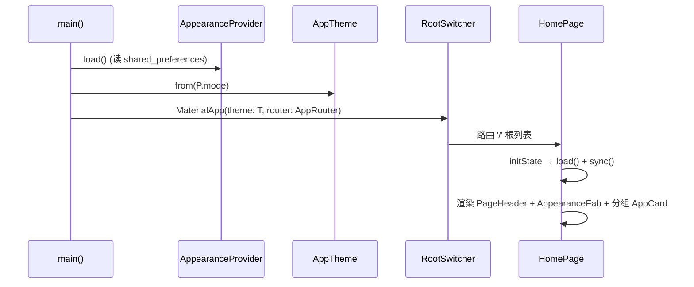
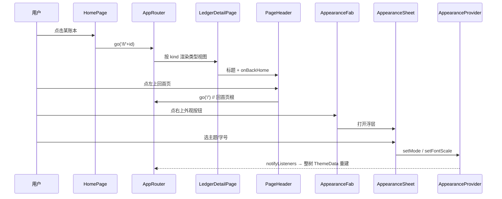
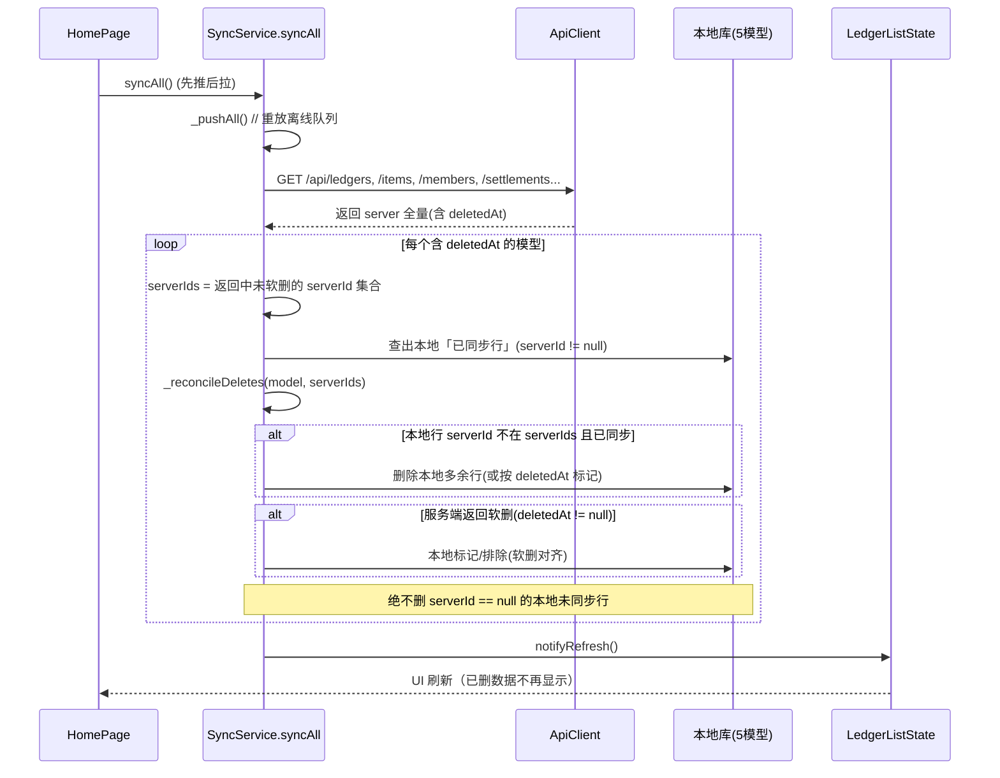
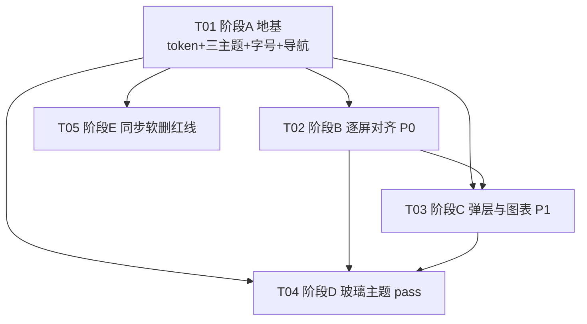

# 架构设计 + 任务分解 · MyAccountBook「心愿便利贴」Flutter 移动端 UI 1:1 还原网页端

> 作者：架构师 Bob（software-architect）
> 日期：2026-08-09
> 协作团队：software-flutter-ui1to1-027c
> 输入：PRD `mobile/PRD_UI_1TO1.md`、团队简报、`.workbuddy/memory/*_memory.md`、Ardot 设计稿 `fileId 712589903280969` 经主理人同步的 token

---

## ⚠️ 沙箱事实声明（务必先读）

本沙箱内**仅有** `mobile/PRD_UI_1TO1.md` 与 `.workbuddy/memory/*_memory.md`，**不存在** `mobile/lib/`（现有 Flutter 代码）也**不存在** `app/`（网页端 Next.js 源码）。`#ff2d87` 及网页端 token 在本沙箱任何文件里均未出现；`WorkBuddy/2026-08-08-11-43-07/` 是一个**无关的「记打卡」习惯类 App**（品牌色 `#6366f1`），**不是**本项目的设计来源，切勿混淆。

因此本设计以以下**已文档化的事实**为唯一依据（PRD §5.2「验收现状」、PRD「侦察依据」、团队简报、MEMORY 记忆）：

- `main.dart`：`colorSchemeSeed: Colors.teal`（待替换）。
- `HomePage.initState` → `load()` + `sync()`；右上「同步 / 退出」按钮；分组账本列表。
- `routes.dart`：`pageForLedger` 按 kind 路由 4 类账本页。
- `constants.dart`：`apiBaseUrl=https://jz.686295.xyz`、4 种 kind。
- `SyncService.syncAll`：先推后拉、`_syncing` 守卫、`unauthorized`→`clearSession()`、**`_pullAll` 仅 insert/upsert、不删本地多余行**。
- `state/ledger_list_state.dart`：sync 触发源。
- `api/api_client.dart`：带 Origin 绕 CSRF。
- 设计 token：ink 灰阶（ink-900/800/700/100/400/500）、品牌粉 `#ff2d87`、emerald 收入绿、red 支出红、amber；深色调色板与液态玻璃参数（背景 {0.984,0.961,1}、白磨砂 fill white/0.5 + stroke white/0.7）来自 Ardot 设计稿 relay。

> **工程师须知**：本设计对文件/类的命名沿用上述现有命名。在真实仓库落地时，请以实际 `mobile/lib/` 为准；本文档中的「MODIFY/NEW」标注基于 PRD 侦察依据推断。

---

# Part A：系统设计

## 1. 实现方案 + 框架选型

### 1.1 核心技术难点

| # | 难点 | 关键点 |
|---|---|---|
| D1 | 三主题色板 1:1 | 用自定义 token 替换 Material3 teal seed，light/dark/glass 三套 `ThemeData` 色值须与网页端 hex 逐一对齐（含 ink 灰阶、品牌粉、语义色） |
| D2 | 运行时主题切换无重启闪烁 | 单一 `AppearanceProvider` 驱动，整树 `Consumer` 重建 `ThemeData` |
| D3 | 字号三档缩放 | 用 `MediaQuery(textScaler:)` 包裹根，受控系数，避免系统 `textScaleFactor` 不可控 |
| D4 | liquid 玻璃性能 | `BackdropFilter` + 半透明白 + 描边；中低端安卓需控制 blur 半径与玻璃面积 |
| D5 | 导航范式改造 | 移除底部 Tab（若存在）、首页列表为根、详情左上回首页、右上外观 FAB；同步/退出按钮重新安放 |
| D6 | 同步红线缺口 | `_pullAll` 拉取后比对 `serverId` 集合，清理本地已不存在且已同步的行（5 个模型含 `deletedAt`） |

### 1.2 框架 / 库选型

| 关注点 | 选型 | 版本建议 | 理由 |
|---|---|---|---|
| 主题/外观状态 | `provider` | ^6.1.2 | 轻量，与现有 `ChangeNotifier` 风格（`ledger_list_state`）契合，整树重建成本低 |
| 导航 | `go_router` | ^14.2.7 | 直接映射网页端路由（`/`、`/l/:id`、`/stats`、`/search`、`/settings`、`/login`），「回首页」语义清晰；现有 `routes.dart` 的 `pageForLedger` 可保留为路由 builder | 
| 图表 | `fl_chart` | ^0.68.0 | 趋势折线/柱状 + 占比饼图，能力覆盖网页端 SVG 图；`charts_flutter` 已停更，弃用 |
| 外观持久化 | `shared_preferences` | ^2.3.2 | 存主题模式 + 字号档位 |
| 金额/多币种格式化 | `intl` | ^0.19.0 | 货币符号、多币种；大概率已是依赖，显式声明 |
| 结算单分享 | `share_plus` | ^10.0.0 | SettlementSheet 分享（P1） |
| 玻璃/模糊 | **原生 `BackdropFilter`** | — | 无需额外包，可控 blur 与填充，性能优于第三方玻璃包 |

> 注：导航若团队偏好最小改动，可用「`Navigator` + `AppRouter` 包装」替代 `go_router`，但 `go_router` 对网页路由 1:1 还原更干净，列为**推荐**。

### 1.3 架构模式

- **主题层**：`AppearanceProvider`（ChangeNotifier）为唯一真相源 → `AppTheme.from(mode)` 产出 `ThemeData` → `MaterialApp.theme` 消费。
- **组件层**：token 化复用组件（`AppCard`/`AppPrimaryButton`/`MoneyText`/`PageHeader`/图表/弹层），全部从 `AppColors` 取色，不直接写死色值。
- **导航层**：`go_router` 单一路由表，首页 `/` 为根；详情 `/l/:id` 经 `pageForLedger` 按 kind 渲染 4 类视图；`PageHeader` 提供「回首页」。
- **同步层**：保持 `SyncService` 现状，仅补 `_pullAll` 软删对账（红线，见任务 E）。

---

## 2. 文件列表（相对 `mobile/`）

> 标注：🆕 新增 / ✏️ 修改（基于现有推断）

```
mobile/
├─ pubspec.yaml                          ✏️  新增依赖（provider/go_router/fl_chart/shared_preferences/intl/share_plus）
├─ lib/
│  ├─ main.dart                          ✏️  移除 teal seed，包裹 AppearanceProvider + 应用 AppTheme.from(mode)
│  ├─ routes.dart                        ✏️  pageForLedger 保留；移除底部 Tab 配置（若存在）
│  ├─ constants.dart                     （apiBaseUrl / 4 kind，基本不变）
│  ├─ theme/
│  │  ├─ app_colors.dart                 ✏️  重写为网页 token 映射（ink/品牌粉/语义色/三主题 surface）
│  │  ├─ app_theme.dart                  ✏️  由 AppColors 构建 light/dark/glass 三套 ThemeData + 字号 textTheme
│  │  ├─ tokens.dart                     🆕 圆角/间距/阴影常量 + FONT_SCALES 三档系数列表
│  │  ├─ appearance_provider.dart        🆕 主题模式 + 字号档位 + 持久化（shared_preferences）
│  │  └─ glass_decoration.dart           🆕 可复用玻璃容器（BackdropFilter + 半透明白填充 + 描边）
│  ├─ appearance/
│  │  ├─ appearance_fab.dart             🆕 右上外观浮动按钮
│  │  └─ appearance_sheet.dart           🆕 主题切换 + 字号三档浮层
│  ├─ router/
│  │  └─ app_router.dart                 🆕 go_router 路由表（映射网页端路由）
│  ├─ ui/
│  │  ├─ home_page.dart                  ✏️  根列表（4 类分组）+ PageHeader + 外观 FAB + 空状态
│  │  ├─ login_page.dart                 ✏️  套用新主题
│  │  ├─ register_page.dart              ✏️  套用新主题
│  │  ├─ stats_page.dart                 🆕 统计页（/stats）
│  │  ├─ search_page.dart                🆕 搜索页（/search）
│  │  ├─ settings_page.dart              🆕 设置页（/settings：外观/字号/退出登录/手动同步）
│  │  ├─ shared_entry_page.dart          🆕 /l/[id] 共享入口（owner 自访按 kind 重定向类型视图）
│  │  └─ ledger_detail/
│  │     ├─ base_detail_page.dart        🆕 详情基类（PageHeader 回首页 + 记一笔入口）
│  │     ├─ general_detail_page.dart     🆕 GeneralView
│  │     ├─ work_detail_page.dart        🆕 WorkView（每月卡片/垫款回款）
│  │     ├─ taoyuan_detail_page.dart     🆕 TaoyuanView + 状态 pill
│  │     └─ travel_detail_page.dart      🆕 TravelView（多币种 AA/最优结算）
│  ├─ widgets/
│  │  ├─ app_card.dart                   ✏️  token 化卡片（solid/glass 变体）
│  │  ├─ app_primary_button.dart         🆕 主按钮（品牌粉）
│  │  ├─ money_text.dart                 🆕 语义金额文字（emerald 收入/red 支出）
│  │  ├─ page_header.dart                🆕 标题 + 回首页 + 右上插槽（放外观 FAB）
│  │  ├─ confirm_delete_dialog.dart      🆕 确认删除 Dialog
│  │  ├─ sync_status.dart                ✏️  同步 Toast / 空状态（复用）
│  │  ├─ record_sheet.dart               🆕 记一笔 BottomSheet（按 kind 4 变体）
│  │  ├─ charts/
│  │  │  ├─ trend_chart.dart             🆕 fl_chart 趋势折线/柱状
│  │  │  └─ category_pie.dart            🆕 fl_chart 占比饼图
│  │  ├─ modals/
│  │  │  ├─ settings_modal.dart          🆕 通用 SettingsModal
│  │  │  ├─ travel_settings_modal.dart   🆕 TravelSettingsModal
│  │  │  └─ trip_members_modal.dart      🆕 TripMembersModal
│  │  └─ sheets/
│  │     └─ settlement_sheet.dart        🆕 SettlementSheet（分享）
│  ├─ sync/
│  │  └─ sync_service.dart               ✏️  修复 _pullAll 软删对账（红线）
│  ├─ state/
│  │  └─ ledger_list_state.dart          ✏️  sync 触发/消费外观若需
│  └─ api/
│     └─ api_client.dart                 （基本不变，Origin 已就位）
└─ docs/
   ├─ system_design.md                   🆕 本文
   ├─ class-diagram.mermaid              🆕 类图
   └─ sequence-diagram.mermaid           🆕 时序图
```

---

## 3. 数据结构与接口（类图）

```mermaid
classDiagram
    %% ===== 主题 / 外观层 =====
    class AppearanceMode {
        <<enum>>
        light
        dark
        glass
    }
    class FontScale {
        <<enum>>
        compact   // 0.92
        normal    // 1.0
        large     // 1.15
    }
    class AppColors {
        <<static>>
        + Color ink900
        + Color ink800
        + Color ink700
        + Color ink500
        + Color ink400
        + Color ink100
        + Color brandPink  // #ff2d87
        + Color emerald    // 收入绿
        + Color red        // 支出红
        + Color amber      // 警告
        + Color surfaceLight()
        + Color surfaceDark()
        + Color surfaceGlass()
    }
    class AppearanceProvider {
        <<ChangeNotifier>>
        - AppearanceMode _mode
        - FontScale _fontScale
        + AppearanceMode get mode
        + FontScale get fontScale
        + double get scaleFactor
        + Future~void~ load()
        + void setMode(AppearanceMode m)
        + void setFontScale(FontScale s)
        - Future~void~ _persist()
    }
    class AppTheme {
        <<static>>
        + ThemeData light
        + ThemeData dark
        + ThemeData glass
        + ThemeData from(AppearanceMode m)
        - TextTheme _textTheme(double factor)
    }
    class GlassDecoration {
        <<static>>
        + BoxDecoration boxDecoration()
        + Widget clip(BackdropFilter child)
    }

    AppearanceProvider ..> AppearanceMode : holds
    AppearanceProvider ..> FontScale : holds
    AppTheme ..> AppColors : reads
    AppTheme ..> AppearanceMode : from()
    GlassDecoration ..> AppColors : uses

    %% ===== 复用组件层 =====
    class AppCard {
        <<StatelessWidget>>
        + Widget child
        + CardVariant variant  // solid | glass
        + VoidCallback? onTap
    }
    class AppPrimaryButton {
        <<StatelessWidget>>
        + String label
        + VoidCallback? onPressed
        + ButtonVariant variant
    }
    class MoneyText {
        <<StatelessWidget>>
        + num amount
        + MoneyType type  // income | expense | neutral
    }
    class PageHeader {
        <<StatelessWidget>>
        + String title
        + VoidCallback onBackHome
        + Widget? trailing
    }
    class AppearanceFab {
        <<StatelessWidget>>
        + VoidCallback onTap
    }
    class AppearanceSheet {
        <<StatelessWidget>>
        - void _onPickMode(AppearanceMode)
        - void _onPickScale(FontScale)
    }
    class ConfirmDeleteDialog {
        <<StatelessWidget>>
        + String title
        + VoidCallback onConfirm
    }
    class RecordSheet {
        <<StatelessWidget>>
        + LedgerKind kind
        + String ledgerId
    }
    class TrendChart {
        <<StatelessWidget>>
        + List~Point~ data
        + String period  // daily | monthly
    }
    class CategoryPie {
        <<StatelessWidget>>
        + Map~String,num~ categories
    }
    class SyncStatusWidget {
        <<StatelessWidget>>
        + SyncState state
    }

    AppCard ..> GlassDecoration : uses(glass variant)
    AppCard ..> AppColors : colors
    MoneyText ..> AppColors : emerald/red
    AppPrimaryButton ..> AppColors : brandPink
    AppearanceSheet ..> AppearanceProvider : setMode/setFontScale

    %% ===== 页面 / 导航层 =====
    class AppRouter {
        <<static>>
        + GoRouter router
        + void toLedger(String id)
        + void backHome()
    }
    class HomePage {
        <<StatefulWidget>>
        + void load()
        + void sync()
    }
    class LedgerDetailPage {
        <<abstract>>
        + String ledgerId
        + LedgerKind kind
    }
    class GeneralDetailPage
    class WorkDetailPage
    class TaoyuanDetailPage
    class TravelDetailPage
    class StatsPage
    class SearchPage
    class SettingsPage
    class SharedEntryPage
    class LoginPage
    class RegisterPage

    LedgerDetailPage <|-- GeneralDetailPage
    LedgerDetailPage <|-- WorkDetailPage
    LedgerDetailPage <|-- TaoyuanDetailPage
    LedgerDetailPage <|-- TravelDetailPage
    AppRouter ..> HomePage : '/'
    AppRouter ..> LedgerDetailPage : '/l/:id'
    AppRouter ..> StatsPage : '/stats'
    AppRouter ..> SearchPage : '/search'
    AppRouter ..> SettingsPage : '/settings'

    HomePage ..> PageHeader : uses
    HomePage ..> AppearanceFab : uses
    HomePage ..> AppCard : ledger groups
    LedgerDetailPage ..> PageHeader : back-home
    LedgerDetailPage ..> RecordSheet : 记一笔
    LedgerDetailPage ..> MoneyText : amounts
    LedgerDetailPage ..> AppCard : cards
    StatsPage ..> TrendChart : uses
    StatsPage ..> CategoryPie : uses
    TravelDetailPage ..> SettlementSheet : uses
    AppearanceFab ..> AppearanceSheet : opens

    %% ===== 同步 / 状态层（红线）=====
    class SyncService {
        <<existing>>
        + Future~bool~ syncAll()
        - Future~void~ _pushAll()
        - Future~void~ _pullAll()
        - Future~void~ _reconcileDeletes(String model, Set~String~ serverIds)
    }
    class LedgerListState {
        <<ChangeNotifier>>
        + void triggerSync()
        + void notifyRefresh()
    }
    class ApiClient {
        <<existing>>
        + Future~Response~ get(path)
        + Future~Response~ post(path, body)
    }

    HomePage ..> SyncService : sync()
    SyncService ..> ApiClient : pull/push
    SyncService ..> LedgerListState : notifyRefresh
    LedgerListState ..> AppearanceProvider : (optional) consume
```

---

## 4. 程序调用流程（导航改造 + 红线）

### 4.1 启动与主题装配



### 4.2 导航范式（首页根 / 回首页 / 外观 FAB）



> **底部 Tab 处置**：现有 `HomePage` 是否有 `Scaffold.bottomNavigationBar` 无法在本沙箱核实（见待明确事项）。本设计默认**导航范式 = 无底部 Tab**，首页为根、回首页 + 外观 FAB。若真实仓库存在底部 Tab，`routes.dart` / `home_page.dart` 必须**移除**该 `bottomNavigationBar`，改用 `PageHeader` 顶部导航。

> **同步 / 退出 按钮安放**（对应 PRD 待确认 5）：现有右上「同步 / 退出」移入 `/settings` 页；首页右上仅保留「外观 FAB」。同步在首页 `initState` 自动触发 + 列表下拉刷新；退出登录在 `/settings`。此处置为**推荐方案**，需用户拍板（见待明确事项 5）。

### 4.3 同步红线：_pullAll 软删对账（P0/P1 必含）



---

## 5. 待明确 / 冲突事项（Anything UNCLEAR）

1. **沙箱缺源码（已声明于文首）**：本沙箱无 `mobile/lib/` 与 `app/`，设计依据为 PRD§5.2 + 团队简报 + MEMORY + Ardot relay token。工程师在真实仓库落地，需以实际文件为准。
2. **是否有底部 Tab 待核实**（PRD 冲突点）：PRD 要求「移除任何移动端专属底部 Tab」，但现有 `HomePage` 侦察依据未明确提及 bottom Tab。→ **以真实仓库代码为准**，若有则必须移除（本设计按「无 Tab」范式）。
3. **精确路由字符串**：`/work`、`/taoyuan` 与 `/l/[id]` 关系、通用/旅游对应路由无法在本沙箱核对（Ardot 适配器未连接）。→ 采用 `/l/:id` 为规范入口，`pageForLedger` 按 kind 渲染；`/work`、`/taoyuan` 仅作 owner 快捷别名（可选）。需用户/工程师在真实仓库逐项核对。
4. **Ardot 精确 hex 待最终校验**：ink-900/800/700/100/400/500、emerald/red/amber 的具体 hex 以 Ardot `712589903280969` 为唯一基准；本文给出的为最佳已知值，适配器恢复后须回灌核对。

> 以下为 **PRD §6 七条待确认** 的归类（标 ★ 为必须用户拍板）：

| # | 问题 | 本文处置 | 必须拍板 |
|---|---|---|---|
| 1 | 统计/搜索口径：全成员 vs owner | 默认「全成员」（与网页端 `/stats`、`/search` 一致） | ★ 是 |
| 2 | 是否存在移动端简化版页面 | 默认「严格 1:1，无简化版」 | 否（按 PRD 默认即可） |
| 3 | 精确路由字符串 | 见上文 #3 | ★ 是（需真实仓库核对） |
| 4 | P2 范围（桃源 pill / 银行卡加密） | 默认本期不做 P2 | ★ 是 |
| 5 | 外观按钮职责 + 同步/退出安放 | 推荐：外观 FAB 承载主题+字号；同步自动+下拉刷新；退出进 /settings | ★ 是 |
| 6 | liquid 玻璃性能/可读性 | 评估见 §1.2 D4：BackdropFilter + 限制玻璃面积 | 否（架构师评估结论，可继续） |
| 7 | 多币种/金额展示一致性 | 默认沿用现有 `constants` 币种符号；独立一轮另议 | 否（先按现状） |

**可先给推荐假设继续的项**：#2、#6、#7；**必须用户拍板的项**：#1、#3、#4、#5。

---

# Part B：任务分解

## 6. 依赖包列表（`pubspec.yaml` 新增）

```
- provider: ^6.1.2            # 外观/主题全局状态
- go_router: ^14.2.7          # 导航范式（映射网页端路由）
- fl_chart: ^0.68.0           # 趋势图 + 占比饼图
- shared_preferences: ^2.3.2  # 外观持久化
- intl: ^0.19.0               # 货币/多币种格式化（若已存在则升级显式声明）
- share_plus: ^10.0.0         # 结算单分享（P1）
```
> 玻璃/模糊用原生 `BackdropFilter`，无需额外包。

## 7. 任务列表（有序，按实现阶段，顶层 A–E 共 5 个里程碑，每里程碑含子项）

### T01 · 阶段 A：地基（设计 token + 三主题 + 字号 + 导航范式）
- **优先级**：P0　**依赖**：无（地基，最先）
- **源文件**：`pubspec.yaml`、`lib/main.dart`、`lib/theme/app_colors.dart`、`lib/theme/app_theme.dart`、`lib/theme/tokens.dart`、`lib/theme/appearance_provider.dart`、`lib/theme/glass_decoration.dart`、`lib/appearance/appearance_fab.dart`、`lib/appearance/appearance_sheet.dart`、`lib/router/app_router.dart`、`lib/routes.dart`、`lib/ui/home_page.dart`、`lib/widgets/page_header.dart`、`lib/widgets/app_card.dart`、`lib/widgets/app_primary_button.dart`、`lib/widgets/money_text.dart`
- **子项**：
  1. token 映射：teal→品牌粉 + ink 灰阶 + emerald/red/amber（替换 `AppColors`/`AppTheme` 骨架，保留结构）。
  2. 三主题：light/dark/glass 三套 `ThemeData`（glass 用 `GlassDecoration`）。
  3. 字号三档：`tokens.dart` 定义 `FONT_SCALES=[0.92,1.0,1.15]`，根 `MediaQuery(textScaler:)` 包裹；`AppearanceProvider` 持久化。
  4. 导航改造：`go_router` 路由表；`HomePage` 改为根列表 + `PageHeader`(回首页) + `AppearanceFab`；**移除底部 Tab（若真实仓库存在）**；同步/退出移入 `/settings`。

### T02 · 阶段 B：逐屏对齐（P0 页）
- **优先级**：P0　**依赖**：T01
- **源文件**：`lib/ui/login_page.dart`、`lib/ui/register_page.dart`、`lib/ui/home_page.dart`(空状态)、`lib/ui/ledger_detail/base_detail_page.dart`、`general_detail_page.dart`、`work_detail_page.dart`、`taoyuan_detail_page.dart`、`travel_detail_page.dart`、`lib/ui/shared_entry_page.dart`、`lib/widgets/record_sheet.dart`、`lib/widgets/confirm_delete_dialog.dart`、`lib/widgets/sync_status.dart`
- **子项**：登录/注册套主题；首页 4 类分组 + 空状态「还没有账本，去网页端创建吧」；4 类账本详情（General/Work/Taoyuan/Travel 视图对齐）；记一笔×4（BottomSheet 按 kind 变体）；确认删除 Dialog；同步 Toast / 空状态。

### T03 · 阶段 C：弹层与图表（P1）
- **优先级**：P1　**依赖**：T01, T02
- **源文件**：`lib/ui/stats_page.dart`、`lib/ui/search_page.dart`、`lib/widgets/charts/trend_chart.dart`、`lib/widgets/charts/category_pie.dart`、`lib/widgets/modals/settings_modal.dart`、`lib/widgets/modals/travel_settings_modal.dart`、`lib/widgets/modals/trip_members_modal.dart`、`lib/widgets/sheets/settlement_sheet.dart`、`lib/ui/settings_page.dart`
- **子项**：统计页（趋势图 + 占比饼图）、搜索页、通用 `SettingsModal`、旅游 `TravelSettingsModal`、成员 `TripMembersModal`、结算 `SettlementSheet`、设置页 `/settings`（外观/字号/退出/手动同步）、外观浮层（主题+字号）。

### T04 · 阶段 D：liquid 玻璃主题 pass（default 暗 + 玻璃两套）
- **优先级**：P1　**依赖**：T01（可与 T02/T03 并行，但建议置于 B/C 后统一收口）
- **源文件**：`lib/theme/glass_decoration.dart`、`lib/theme/app_theme.dart`(glass)、`lib/widgets/app_card.dart`(glass 变体)、各详情页/弹层（glass 视觉一致）
- **子项**：default 暗主题精修；glass 主题在卡片/弹层/详情页的一致渲染；`BackdropFilter` 半径与面积性能调优（中低端机）。

### T05 · 阶段 E：同步红线 — `_pullAll` 软删对账（P0/P1 内必含）
- **优先级**：P0（红线）　**依赖**：T01（可尽早并行，但改动作用于同步层，安全起见置于地基后）
- **源文件**：`lib/sync/sync_service.dart`、`lib/state/ledger_list_state.dart`
- **子项**：
  1. `_pullAll` 拉取后构建各模型 `serverIds`（未软删集合）。
  2. 新增 `_reconcileDeletes(model, serverIds)`：删除本地「已同步行(serverId≠null) 且不在 serverIds」的多余数据。
  3. 服务端软删（`deletedAt≠null`）→ 本地标记/排除，与 5 个模型的 `deletedAt` 口径对齐（聚合 `NOT_DELETED`）。
  4. **绝不删除** `serverId==null` 的本地未同步行（离线优先）。
  5. `notifyRefresh` 触发 UI 刷新。

> 阶段 E 为验收红线（PRD §5.2），缺失则移动端长期显示网页端已删数据。**必须在 P0/P1 交付内完成**。

## 8. 共享知识（跨文件约定）

- **Token 命名规范**：所有色值集中在 `AppColors`（静态常量），组件禁止写死 hex；语义色用 `emerald`/`red`/`amber`/`brandPink`，灰阶用 `ink900..ink100`。
- **主题唯一真相源**：`AppearanceProvider`（`ChangeNotifier`）持有 `mode` + `fontScale`；任何组件通过 `context.watch<AppearanceProvider>()` 取主题，不得自行缓存 `ThemeData`。
- **字号 scale 常量位置**：`lib/theme/tokens.dart` 的 `FONT_SCALES`（`[0.92, 1.0, 1.15]` 对应 小/标准/大），根 `main.dart` 用 `MediaQuery(textScaler: TextScaler.linear(scaleFactor))` 统一缩放。
- **玻璃实现约定**：一律经 `GlassDecoration.boxDecoration()`（BackdropFilter + white/0.5 填充 + white/0.7 描边），禁止各处自行造玻璃。
- **导航约定**：首页 `/` 为根；详情页 `PageHeader` 左上「回首页」= `context.go('/')`；右侧 `AppearanceFab` 唯一入口。
- **同步约定**：保持「先推后拉 + `_syncing` 守卫 + `unauthorized`→`clearSession`」；仅扩展 `_pullAll` 软删对账，不重构其余同步逻辑。

## 9. 任务依赖图



> 说明：T02–T04 均依赖地基 T01；T05 红线可尽早并行，但建议在地基稳定后合入。T03/T04 在 B 之后收口以保证视觉一致性。
